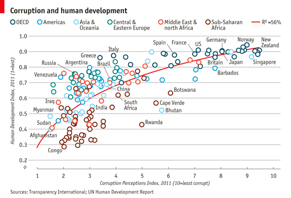
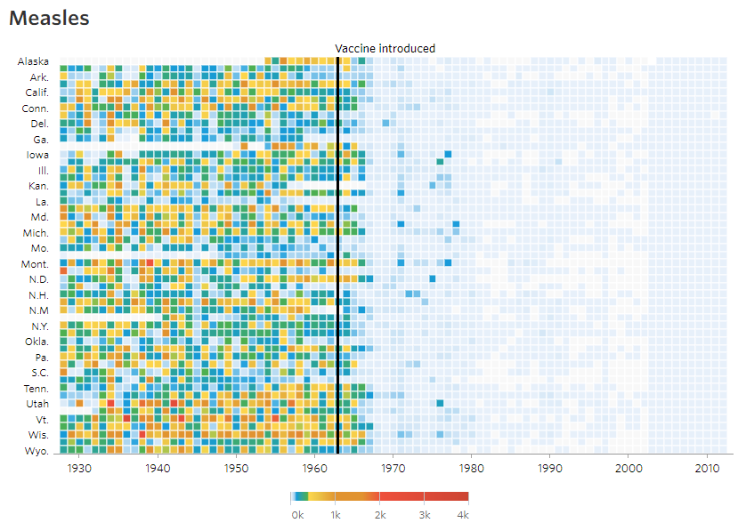

```{r,echo=FALSE,message=FALSE,warning=FALSE,results='hide'}
# run setup code
source("assets/setup.R")
#knitr::opts_chunk$set(fig.height=4,fig.width=6)
```

```{r,echo=FALSE,results='hide'}
## LIBRARIES AND VARIABLES
# load the packages you need for this document

library(dplyr)
library(tidyr)
library(stringr)

library(ggplot2)
library(ggrepel)
library(extrafont)
font_import(pattern="Gidole",prompt=FALSE)

#library(gridExtra)
#library(ggpubr)

# variables needed in this document
# raukr colors
#rv_col_dark <- "#125687"
#rv_col_light <- "#e7eef3"
```


---

<p class="abstract">
This is the hands-on material for **Introduction to `ggplot2`**. These are series of excercises to help you get started and familiarise yourself with ggplot2 syntax, plot building logic and fine modification of plots. The code is hidden by default. Click on the 'Code' button on the right side to show the code.

Practice using the Basics section. Then try to do the challenges yourself. There are two challenge plots: a scatterplot and a heatmap.

<div class="pull-left-50">

</div>

<div class="pull-right-50">

</div>

</p>

---

# Basics

First step is to make sure that `ggplot2` is installed and the package is loaded.

```{r}
library(ggplot2)
```

We use the `iris` data to get started. This dataset has four continuous variables and one categorical variable. It is important to remember about the data type when plotting graphs. 

```{r}
data("iris")
head(iris)
```

## Building a plot

ggplot2 plots are initialised by specifying the dataset. This can be saved to a variable or it draws a blank plot.

```{r,fig.height=4,fig.width=4}
ggplot(data=iris)
```

Now we can specify what we want on the x and y axes using aethetic mapping. And we specify the geometric using geoms. Note that the variable names do not have double quotes `""` like in base plots.

```{r,fig.height=4,fig.width=4}
ggplot(data=iris)+
  geom_point(mapping=aes(x=Petal.Length,y=Petal.Width))
```

## Multiple geoms

Further geoms can be added. For example let's add a regression line. When multiple geoms with the same aesthetics are used, they can be specified as a common mapping. Note that the order in which geoms are plotted depends on the order in which the geoms are supplied in the code. In the code below, the points are plotted first and then the regression line. 

```{r,fig.height=4,fig.width=4}
ggplot(data=iris,mapping=aes(x=Petal.Length,y=Petal.Width))+
  geom_point()+
  geom_smooth(method="lm")
```

## Using colors

We can use the categorical column `Species` to color the points. The color aesthetic is used by `geom_point` and `geom_smooth`. Three different regression lines are now drawn. Notice that a legend is automatically created.

```{r,fig.height=4,fig.width=5}
ggplot(data=iris,mapping=aes(x=Petal.Length,y=Petal.Width,color=Species))+
  geom_point()+
  geom_smooth(method="lm")
```

If we wanted to keep a common regression line while keeping the colors for the points, we could specify color aesthetic only for `geom_point`.

```{r,fig.height=4,fig.width=5}
ggplot(data=iris,mapping=aes(x=Petal.Length,y=Petal.Width))+
  geom_point(aes(color=Species))+
  geom_smooth(method="lm")
```

## Aesthetic parameter

We can change the size of all points by a fixed amount by specifying size outside the aesthetic parameter.
 
```{r,fig.height=4,fig.width=5}
ggplot(data=iris,mapping=aes(x=Petal.Length,y=Petal.Width))+
  geom_point(aes(color=Species),size=3)+
  geom_smooth(method="lm")
```

## Aesthetic mapping

We can map another variable as size of the points. This is done by specifying size inside the aesthetic mapping. Now the size of the points denote `Sepal.Width`. A new legend group is created to show this new aesthetic.

```{r,fig.height=4,fig.width=5}
ggplot(data=iris,mapping=aes(x=Petal.Length,y=Petal.Width))+
  geom_point(aes(color=Species,size=Sepal.Width))+
  geom_smooth(method="lm")
```

## Discrete colors

We can change the default colors by specifying new values inside a scale.
 
```{r,fig.height=4,fig.width=5}
ggplot(data=iris,mapping=aes(x=Petal.Length,y=Petal.Width))+
  geom_point(aes(color=Species,size=Sepal.Width))+
  geom_smooth(method="lm")+
  scale_color_manual(values=c("red","blue","green"))
```

## Continuous colors

We can also map the colors to a continuous variable. This creates a color bar legend item.

```{r,fig.height=4,fig.width=5}
ggplot(data=iris,mapping=aes(x=Petal.Length,y=Petal.Width))+
  geom_point(aes(color=Sepal.Width))+
  geom_smooth(method="lm")
```

## Titles

Now let's rename the axis labels, change the legend title and add a title, a subtitle and a caption. We change the legend title using `scale_color_continuous()`. All other labels are changed using `labs()`.

```{r,fig.height=4,fig.width=5}
ggplot(data=iris,mapping=aes(x=Petal.Length,y=Petal.Width))+
  geom_point(aes(color=Sepal.Width))+
  geom_smooth(method="lm")+
  scale_color_continuous(name="New Legend Title")+
  labs(title="This Is A Title",subtitle="This is a subtitle",x=" Petal Length", 
       y="Petal Width", caption="This is a little caption.")
```

## Axes modification

Let's say we are not happy with the x-axis breaks 2,4,6 etc. We would like to have 1,2,3... We change this using `scale_x_continuous()`.

```{r,fig.height=4,fig.width=5}
ggplot(data=iris,mapping=aes(x=Petal.Length,y=Petal.Width))+
  geom_point(aes(color=Sepal.Width))+
  geom_smooth(method="lm")+
  scale_color_continuous(name="New Legend Title")+
  scale_x_continuous(breaks=1:8)+
  labs(title="This Is A Title",subtitle="This is a subtitle",x=" Petal Length", 
       y="Petal Width", caption="This is a little caption.")
```

## Facetting

We can create subplots using the facetting functionality. Let's create three subplots for the three levels of Species.

```{r,fig.height=4,fig.width=6}
ggplot(data=iris,mapping=aes(x=Petal.Length,y=Petal.Width))+
  geom_point(aes(color=Sepal.Width))+
  geom_smooth(method="lm")+
  scale_color_continuous(name="New Legend Title")+
  scale_x_continuous(breaks=1:8)+
  labs(title="This Is A Title",subtitle="This is a subtitle",x=" Petal Length", 
       y="Petal Width", caption="This is a little caption.")+
  facet_wrap(~Species)
```

## Themes

The look of the plot can be changed using themes. Let's can the default `theme_grey()` to `theme_bw()`.

```{r,fig.height=4,fig.width=6}
ggplot(data=iris,mapping=aes(x=Petal.Length,y=Petal.Width))+
  geom_point(aes(color=Sepal.Width))+
  geom_smooth(method="lm")+
  scale_color_continuous(name="New Legend Title")+
  scale_x_continuous(breaks=1:8)+
  labs(title="This Is A Title",subtitle="This is a subtitle",x=" Petal Length", 
       y="Petal Width", caption="This is a little caption.")+
  facet_wrap(~Species)+
  theme_bw()
```

All non-data related aspects of the plot can be modified through themes. Let's modify the colors of the title labels and turn off the gridlines. The various parameters for theme ca be found using `?theme`.

```{r,fig.height=4,fig.width=6}
ggplot(data=iris,mapping=aes(x=Petal.Length,y=Petal.Width))+
  geom_point(aes(color=Sepal.Width))+
  geom_smooth(method="lm")+
  scale_color_continuous(name="New Legend Title")+
  scale_x_continuous(breaks=1:8)+
  labs(title="This Is A Title",subtitle="This is a subtitle",x=" Petal Length", 
       y="Petal Width", caption="This is a little caption.")+
  facet_wrap(~Species)+
  theme_bw()+
  theme(
    axis.title=element_text(color="Blue",face="bold"),
    plot.title=element_text(color="Green",face="bold"),
    plot.subtitle=element_text(color="Pink"),
    panel.grid=element_blank()
  )
```

Themes can be saved and reused.

```{r,fig.height=4,fig.width=6}
newtheme <- theme(
    axis.title=element_text(color="Blue",face="bold"),
    plot.title=element_text(color="Green",face="bold"),
    plot.subtitle=element_text(color="Pink"),
    panel.grid=element_blank())

ggplot(data=iris,mapping=aes(x=Petal.Length,y=Petal.Width))+
  geom_point(aes(color=Sepal.Width))+
  geom_smooth(method="lm")+
  scale_color_continuous(name="New Legend Title")+
  scale_x_continuous(breaks=1:8)+
  labs(title="This Is A Title",subtitle="This is a subtitle",x=" Petal Length", 
       y="Petal Width", caption="This is a little caption.")+
  facet_wrap(~Species)+
  theme_bw()+
  newtheme

```

## Controlling legends

Here we see two legends based on the two aesthetic mappings.

```{r,fig.height=4,fig.width=5}
ggplot(data=iris,mapping=aes(x=Petal.Length,y=Petal.Width))+
  geom_point(aes(color=Species,size=Sepal.Width))
```

If we don't want to have the extra legend, we can turn off legends individually by aesthetic.

```{r,fig.height=4,fig.width=5}
ggplot(data=iris,mapping=aes(x=Petal.Length,y=Petal.Width))+
  geom_point(aes(color=Species,size=Sepal.Width))+
  guides(size="none")
```

We can also turn off legends by geom.

```{r,fig.height=4,fig.width=5}
ggplot(data=iris,mapping=aes(x=Petal.Length,y=Petal.Width))+
  geom_point(aes(color=Species,size=Sepal.Width),show.legend=FALSE)
```

Legends can be moved around using theme.

```{r,fig.height=4,fig.width=6}
ggplot(data=iris,mapping=aes(x=Petal.Length,y=Petal.Width))+
  geom_point(aes(color=Species,size=Sepal.Width))+
  theme(legend.position="top",
        legend.justification="right")
```

Legend rows can be controlled in a finer manner.

```{r,fig.height=4,fig.width=5}
ggplot(data=iris,mapping=aes(x=Petal.Length,y=Petal.Width))+
  geom_point(aes(color=Species,size=Sepal.Width))+
  guides(size=guide_legend(nrow=2,byrow=TRUE),
         color=guide_legend(nrow=3,byrow=T))+
  theme(legend.position="top",
        legend.justification="right")
```

## Labelling

Items on the plot can be labelled using the `geom_text` or `geom_label` geoms.

```{r,fig.height=4,fig.width=5}
ggplot(data=iris,mapping=aes(x=Petal.Length,y=Petal.Width))+
  geom_point(aes(color=Species))+
  geom_text(aes(label=Species,hjust=0),nudge_x=0.5,size=3)
```

```{r,fig.height=4,fig.width=5}
ggplot(data=iris,mapping=aes(x=Petal.Length,y=Petal.Width))+
  geom_point(aes(color=Species))+
  geom_label(aes(label=Species,hjust=0),nudge_x=0.5,size=3)
```

The R package `ggrepel` allows for non-overlapping labels.

```{r,fig.height=4,fig.width=6}
library(ggrepel)
ggplot(data=iris,mapping=aes(x=Petal.Length,y=Petal.Width))+
  geom_point(aes(color=Species))+
  geom_text_repel(aes(label=Species),size=3)
```

## Annotations

Custom annotations of any geom can be added arbitrarly anywhere on the plot.

```{r,fig.height=4,fig.width=6}
ggplot(data=iris,mapping=aes(x=Petal.Length,y=Petal.Width))+
  geom_point(aes(color=Species))+
  annotate("text",x=2.5,y=2.1,label="There is a random line here")+
  annotate("segment",x=2,xend=4,y=1.5,yend=2)
```

## Barplots

```{r,fig.height=4,fig.width=6}
ggplot(data=iris,mapping=aes(x=Species,y=Petal.Width))+
  geom_bar(stat="identity")
```

## Flip axes

x and y axes can be flipped using `coord_flip`.

```{r,fig.height=4,fig.width=6}
ggplot(data=iris,mapping=aes(x=Species,y=Petal.Width))+
  geom_bar(stat="identity")+
  coord_flip()
```

## Error Bars

An example of using error bars with points. The mean and standard deviation is computed. This is used to create upper and lower bounds for the error bars.

```{r,fig.height=4,fig.width=6}
dfr <- iris %>% group_by(Species) %>% 
  summarise(mean=mean(Sepal.Length),sd=sd(Sepal.Length)) %>%
  mutate(high=mean+sd,low=mean-sd)

ggplot(data=dfr,mapping=aes(x=Species,y=mean,color=Species))+
  geom_point(size=4)+
  geom_errorbar(aes(ymax=high,ymin=low),width=0.2)
```

# Economist Scatterplot

The aim of this challenge is to recreate the plot below originally published in [The Economist](https://www.economist.com/blogs/dailychart/2011/12/corruption-and-development). The graph is a scatterplot showing the relationship between *Corruption Index* and *Human Development Index* for various countries.


## Data

Start by reading in the [data](https://www.dropbox.com/s/7imn0eoey9ckxh5/data_economist.csv?dl=1).

```{r}
ec <- read.csv("ggplot_lab_assets/data_economist.csv",header=T)
head(ec)
```

Make sure that the fields are of the correct type. The x-axis field 'CPI' and the y-axis field 'HDI' must be of numeric type. The categorical field 'Region' must be of Factor type.

```{r}
str(ec)
```

We need to first modify the region column. The current levels in the 'Region' field are:

```{r}
levels(ec$Region)
```

But, the categories on the plot are different and need to be changed as follows:

```
From                  To
EU W. Europe          OECD
Americas              Americas
Asia Pacific          Asia & Oceania
East EU Cemt Asia     Central & Eastern Europe
MENA                  Middle East & North Africa
SSA                   Sub-Saharan Africa
```

Since the 'To' strings are a bit too long to be in one line on the legend, use `\n` to break a line into two lines. 
> `\n` is the newline character in R.

```
From                  To
EU W. Europe          OECD
Americas              Americas
Asia Pacific          Asia &\nOceania
East EU Cemt Asia     Central &\nEastern Europe
MENA                  Middle East &\nNorth Africa
SSA                   Sub-Saharan\nAfrica
```

The strings can be renamed using string replacement or substitution. But a easier way to do it is to use `factor()`. The arguments `levels` and `labels` in function `factor()` can be used to rename factors.

```{r}
ec$Region <- factor(ec$Region,levels = c("EU W. Europe",
                                "Americas",
                                "Asia Pacific",
                                "East EU Cemt Asia",
                                "MENA",
                                "SSA"),
                     labels = c("OECD",
                                "Americas",
                                "Asia &\nOceania",
                                "Central &\nEastern Europe",
                                "Middle East &\nNorth Africa",
                                "Sub-Saharan\nAfrica"))
```

Our new Regions should look like:

```{r}
levels(ec$Region)
```

## Points

Start building up the basic plot. 
> Provide data.frame 'ec' as the data and map field 'CPI' to the x-axis and 'HDI' to the y-axis. Use `geom_point()` to draw point geometry. To select shapes, see [here](https://www.google.se/search?q=r+pch&oq=R+pch). Circular shape can be drawn using 1, 16, 19, 20 and 21. Using shape '21' allows us to control stroke color, fill color and stroke thickness for the points. Check out `?geom_point` and look under 'Aesthetics' for the various possible aesthetic options. Set shape to 21, size to 3, stroke to 0.8 and fill to white.

```{r,fig.height=5,fig.width=7}
ggplot(ec,aes(x=CPI,y=HDI,color=Region))+
    geom_point(shape=21,size=3,stroke=0.8,fill="white")
```

Notice how '\n' has created newlines in the Legend. 

## Trendline

Now, we add the trend line using `geom_smooth`. Check out `?geom_smooth` and look under 'Arguments' for argument options and 'Aesthetics' for the aesthetic options. 
> Use method 'lm' and use a custom formula of `y~poly(x,2)` to approximate the curve seen on the plot. Turn off confidence interval shading. Set line thickness to 0.6 and line color to red.

```{r,fig.height=5,fig.width=7}
ggplot(ec,aes(x=CPI,y=HDI,color=Region))+
  geom_point(shape=21,size=3,stroke=0.8,fill="white")+
  geom_smooth(method="lm",formula=y~poly(x,2),se=F,size=0.6,color="red")

```

Notice that the line in drawn over the points due to the plotting order. We want the points to be over the line. So reorder the geoms. Since we provided no aesthetic mappings to `geom_smooth`, there is no legend entry for the trendline. We can fake a legend entry by providing an aesthetic, for example; `aes(fill="red")`. We do not use the color aesthetic because it is already in use and would give us reduced control later on to modify this legend entry.

```{r,fig.height=5,fig.width=7}
p <- ggplot(ec,aes(x=CPI,y=HDI,color=Region))+
      geom_smooth(aes(fill="red"),method="lm",formula=y~poly(x,2),se=F,color="red",size=0.6)+
      geom_point(shape=21,size=3,stroke=0.8,fill="white")
p
```

## Text Labels

Now we add the text labels. Only a subset of countries are plotted. The list of countries to label is shown below.

```
"Congo","Afghanistan","Sudan","Myanmar","Iraq","Venezuela","Russia","Argentina","Brazil","Italy","South Africa","Cape Verde","Bhutan","Botswana","Britian","New Zealand","Greece","China","India","Rwanda","Spain","France","United States","Japan","Norway","Singapore","Barbados","Germany"
```

> Use `geom_text` to subset the original data.frame to the reduced set above and plot the labels as text. See `?geom_text`.

```{r,fig.height=5,fig.width=7}
labels <- c("Congo","Afghanistan","Sudan","Myanmar","Iraq","Venezuela","Russia","Argentina","Brazil","Italy","South Africa","Cape Verde","Bhutan","Botswana","Britian","New Zealand","Greece","China","India","Rwanda","Spain","France","United States","Japan","Norway","Singapore","Barbados","Germany")

p+geom_text(data=subset(ec,Country %in% labels),aes(label=Country),color="black")
```

## Custom Font

Custom font can be used for the labels by providing the font name to argument `family` like so `geom_text(family="fontname")`. If you do not want to bother with fonts, just avoid the `family` argument in `geom_text` and skip this part.

Using custom fonts can be tricky business. To use a font name, it must be installed on your system and it should be imported into the R environment. This can be done using the `extrafont` package. Try importing one of the fonts available on your system. Not all fonts work. `extrafont` prefers '.ttf' fonts. If a font doesn't work, try another.

```{r,eval=FALSE}
library(extrafont)
font_import(pattern="Times",prompt=FALSE)
font_import(pattern="Trebuchet",prompt=FALSE)
# load fonts for pdf
loadfonts()
# list available fonts in R
fonts()
```

The actual font used on the Economist graph is something close to [ITC Officina Sans](https://www.fontshop.com/families/itc-itc-officina-sans). Since this is not a free font, I am using a free font called [Gidole](https://gidole.github.io/).

```{r,fig.height=5,fig.width=7}
p+geom_text(data=subset(ec,Country %in% labels),aes(label=Country),
            color="black",family="Gidole")
```

## Label Overlap

To avoid overlapping of labels, we can use a `ggplot2` extension package `ggrepel`. We can use function `geom_text_repel()` from the `ggrepel` package. `geom_text_repel()` has the same arguments/aesthetics as `geom_text` and a few more. Skip the `family=Gidole` part if you do not want to change the font.

```{r,fig.height=5,fig.width=7}
library(ggrepel)
p <- p+geom_text_repel(data=subset(ec,Country %in% labels),aes(label=Country),
                       color="black",box.padding=unit(1,'lines'),segment.size=0.25,
                       size=3,family="Gidole")
p
```

## Axes

Next step is to adjust the axes breaks, axes labels, point colors and relabelling the trendline legend text. 
> Change axes labels to 'Corruption Perceptions Index, 2011 (10=least corrupt)' on the x-axis and 'Human Development Index, 2011 (1=best)' on the y-axis. Set breaks on the x-axis from 1 to 10 by 1 increment and y-axis from 0.2 to 1.0 by 0.1 increments.

```{r,fig.height=5,fig.width=7}
p <- p+scale_x_continuous(name="Corruption Perceptions Index, 2011 (10=least corrupt)",
                          breaks=1:10,limits=c(1,10))+
      scale_y_continuous(name="Human Development Index, 2011 (1=best)",
                         breaks=seq(from=0,to=1,by=0.1),limits=c(0.2,1))
p
```

## Scale Colors

Now we want to change the color palette for the points and modify the legend text for the trendline. 

> Use `scale_color_manual()` to provide custom colors. These are the colors to use for the points: `"#23576E","#099FDB","#29B00E", "#208F84","#F55840","#924F3E"`. 
> Use `scale_fill_manual` to change the trendline label since it's a fill scale. The legend entry for the trendline should read 'R^2=52%'.

```{r,fig.height=5,fig.width=7}
p <- p+scale_color_manual(values=c("#23576E","#099FDB","#29B00E", "#208F84","#F55840","#924F3E"))+
       scale_fill_manual(name="trend",values="red",labels=expression(paste(R^2,"=52%")))
p
```

## Title

Title and caption can be added with `labs`. 

> Set the title to 'Corruption and human development'. 
> Set the caption to 'Sources: Transparency International; UN Human Development Report'.

```{r,fig.height=5,fig.width=7}
p <- p+labs(title="Corruption and human development",
            caption="Sources: Transparency International; UN Human Development Report")
p
```

## Theme

We want to move the legend to the top and as a single row. This can be done using `theme()` option `legend.position`. See `?theme`. `guides()` is used to set the number of rows to 1. We also set a custom font for all text elements using `base_family="Gidole"`. This can be skipped if a font change is not required.

```{r,fig.height=5,fig.width=7}
p <- p+guides(color=guide_legend(nrow=1))+
       theme_bw(base_family="Gidole")+
       theme(legend.position="top")
p
```

Now we do some careful refining with themes.

> * Turn off minor gridlines
> * Turn off major gridlines on x-axis
> * Remove the grey background
> * Remove panel border
> * Remove legend titles
> * Make axes titles italic
> * Turn off y-axis ticks
> * Change x-axis ticks to color grey60
> * Make plot title bold
> * Decrease size of caption to size 8

```{r,fig.height=5,fig.width=7}
p+theme(panel.grid.minor=element_blank(),
          panel.grid.major.x=element_blank(),
          panel.background=element_blank(),
          panel.border=element_blank(),
          legend.title=element_blank(),
          axis.title=element_text(face="italic"),
          axis.ticks.y=element_blank(),
          axis.ticks.x=element_line(color="grey60"),
          plot.title=element_text(face="bold"),
          plot.caption=element_text(hjust=0,size=8))

```

And now our plot is ready and we can compare with the original.


The full script for this challenge is summarised here:

```{r,eval=FALSE}

# read data
ec <- read.csv("ggplot_lab_assets/data_economist.csv",header=T)
# refactor
ec$Region <- factor(ec$Region,
                    levels = c("EU W. Europe","Americas","Asia Pacific",
                                "East EU Cemt Asia","MENA","SSA"),
                     labels = c("OECD","Americas","Asia &\nOceania",
                                "Central &\nEastern Europe",
                                "Middle East &\nNorth Africa",
                                "Sub-Saharan\nAfrica"))

# labels
labels <- c("Congo","Afghanistan","Sudan","Myanmar","Iraq","Venezuela","Russia","Argentina","Brazil","Italy","South Africa","Cape Verde","Bhutan","Botswana","Britian","New Zealand","Greece","China","India","Rwanda","Spain","France","United States","Japan","Norway","Singapore","Barbados","Germany")

# plotting
p1 <- ggplot(ec,aes(x=CPI,y=HDI,color=Region))+
      geom_smooth(aes(fill="red"),method="lm",formula=y~poly(x,2),se=F,color="red",size=0.6)+
      geom_point(shape=21,size=3,stroke=0.8,fill="white")+
      geom_text_repel(data=subset(ec,Country %in% labels),aes(label=Country),
                       color="black",box.padding=unit(1,'lines'),segment.size=0.25,
                       size=3,family="Gidole")+
      scale_x_continuous(name="Corruption Perceptions Index, 2011 (10=least corrupt)",
                          breaks=1:10,limits=c(1,10))+
      scale_y_continuous(name="Human Development Index, 2011 (1=best)",
                         breaks=seq(from=0,to=1,by=0.1),limits=c(0.2,1))+
      scale_color_manual(values=c("#23576E","#099FDB","#29B00E", "#208F84","#F55840","#924F3E"))+
           scale_fill_manual(name="trend",values="red",labels=expression(paste(R^2,"=52%")))+
      labs(title="Corruption and human development",
           caption="Sources: Transparency International; UN Human Development Report")+
      guides(color=guide_legend(nrow=1))+
      theme_bw(base_family="Gidole")+
      theme(legend.position="top",
            panel.grid.minor=element_blank(),
            panel.grid.major.x=element_blank(),
            panel.background=element_blank(),
            panel.border=element_blank(),
            legend.title=element_blank(),
            axis.title=element_text(face="italic"),
            axis.ticks.y=element_blank(),
            axis.ticks.x=element_line(color="grey60"),
            plot.title=element_text(face="bold"),
            plot.caption=element_text(hjust=0,size=8))
p1
```

# WSJ Heatmap

The aim of this challenge is to recreate the plot below originally published in [The Wall Street Journal](http://graphics.wsj.com/infectious-diseases-and-vaccines/). The plot is a heatmap showing the normalised number of cases of measles across 51 US states from 1928 to 2003. X-axis shows years and y-axis shows the names of states. The color of the tiles denote the number of measles cases per 100,000 people. Introduction of the measles vaccine is shown as the black line in 1963.


## Data

Start by reading in the [data](https://www.dropbox.com/s/19p8vku0i9np26b/data_wsj.csv?dl=1). This .csv file has two lines of comments so we need to skip 2 lines while reading in the data. We also add `stringsAsFactors=F` to avoid the automatic conversion of character fields to factor type.

```{r}
me <- read.csv("ggplot_lab_assets/data_wsj.csv",header=T,stringsAsFactors=F,skip=2)
head(me)
```

Check the data type for the fields.

```{r}
str(me)
```

Looking at this dataset, there is going to be quite a bit of data clean-up and tidying before we can plot it. Here are the steps we need to take:

> * The data needs to be transformed to long format.
> * Replace all "-" with NAs
> * The number of cases across each state is a character and needs to be converted to numeric
> * Collapse (sum) week-level data to year.
> * Abbreviate state names

## Tidy Data

Convert the wide format to long format using the function `gather()` from package `dplyr`.

```{r}
me1 <- me %>% gather(key=state,value=value,-YEAR,-WEEK)
head(me1)
```

Now, replace all '-' with NA in the field value. We use the function `str_replace()` from R package `stringr`. Then convert the value field to numeric.

```{r}
me2 <- me1 %>% mutate(value=str_replace(value,"^-$",NA_character_),
                      value=as.numeric(value))
head(me2)
```

Sum up the week-level information to year-level information. This means rather than having

```
  YEAR WEEK   state value
1 1928    1 ALABAMA  3.67
2 1928    2 ALABAMA  6.25
3 1928    3 ALABAMA  7.95
...
5501 1957   41 ALASKA  2.16
5502 1957   42 ALASKA  0.43
5503 1957   43 ALASKA  1.30
...
```

we should have one value per year per state.

```
  YEAR    state value
1 1928  ALABAMA  3.67
2 1929  ALABAMA  3.20
...
5501 1957  ALASKA  2.16
5502 1958  ALASKA  2.05
...
```

The solution is to sum up all the cases for a state for all weeks within a year into one value for that year. This can be done using the `summarise()` function from package `dplyr`. 

> * A custom function is used to sum over weeks. If all values are NA, then result is NA. If some values are NA, the NAs are removed and the remaining numbers are summed.
> * The dots in state names are replaced by spaces and the words are converted to title case (First letter capital and rest lowercase). 
> * We also convert the column names to lowercase for consistency.

```{r}
fun1 <- function(x) ifelse(all(is.na(x)),NA,sum(x,na.rm=TRUE))

me3 <- me2 %>% group_by(YEAR,state) %>% 
                summarise(total=fun1(value)) %>%
                mutate(state=str_replace_all(state,"[.]"," "),
                       state=str_to_title(state))
colnames(me3) <- tolower(colnames(me3))
head(me3)
```

```{r}
str(me3)
```

The data is now ready for plotting.

## Tile

We can build up a basic ggplot and heatmap tiles can be plotted using the geom `geom_tile`. 'year' is mapped to the x-axis, 'state' to the y-axis and fill color for the tiles is the 'total' value.

```{r,fig.height=6,fig.width=9}
ggplot(me3,aes(x=year,y=state,fill=total))+
       geom_tile()
```

Add borders around the tiles. We use `reorder(state,desc(state))` to reverse the order of states so that it reads A-Z from top to bottom.

```{r,fig.height=6,fig.width=9}
p <- ggplot(me3,aes(x=year,y=reorder(state,desc(state)),fill=total))+
      geom_tile(color="white",size=0.25)
p
```

## Scales

The extra space on left and right (grey) of the plot is removed using argument `expand` in `scales`. X-axis breaks are redefined at 10 year intervals from 1930 to 2010. Custom colors are used for the tiles: `"#e7f0fa","#c9e2f6","#95cbee","#0099dc","#4ab04a", "#ffd73e","#eec73a","#e29421","#f05336","#ce472e"`. Since the color scale is a fill color on a continuous value and we want to supply n new colors, we use `scale_fill_gradientn`. Tiles with missing value is set to the color `"grey90"`.

```{r,fig.height=6,fig.width=9}
cols <- c("#e7f0fa","#c9e2f6","#95cbee","#0099dc","#4ab04a", "#ffd73e","#eec73a","#e29421","#f05336","#ce472e")

p + scale_y_discrete(expand=c(0,0))+
    scale_x_continuous(expand=c(0,0),breaks=seq(1930,2010,by=10))+
    scale_fill_gradientn(colors=cols,na.value="grey95")
```

The fill scale can be further refined to resemble that of the original plot.

```{r,fig.height=6,fig.width=9}
cols <- c("#e7f0fa","#c9e2f6","#95cbee","#0099dc","#4ab04a", "#ffd73e","#eec73a","#e29421","#f05336","#ce472e")

p <- p+ scale_y_discrete(expand=c(0,0))+
        scale_x_continuous(expand=c(0,0),breaks=seq(1930,2010,by=10))+
        scale_fill_gradientn(colors=cols,na.value="grey95",
                             limits=c(0,4000),
                             values=c(0,0.01,0.02,0.03,0.09,0.1,0.15,0.25,0.4,0.5,1),
                             labels=c("0k","1k","2k","3k","4k"),
                             guide=guide_colourbar(ticks=T,nbin=50,
                                                 barheight=.5,label=T, 
                                                 barwidth=10))
p
```

## Title

We can remove the x and y axes titles and add a plot title.

```{r,fig.height=6,fig.width=9}
p <- p+labs(x="",y="",fill="",title="Measles")
p
```

## Fixed Coords

We can use `coord_fixed()` to fix the coordinates for equal values in x and y direction. This should render perfectly square tiles.

```{r,fig.height=6,fig.width=9}
p <- p+coord_fixed()
p
```

## Annotation

Add the annotation line and text to denote the introduction of the vaccine. The line is at the position 1963. Custom font 'Gidole' is used here. This can be skipped.

```{r,fig.height=6,fig.width=9}
p <- p+geom_segment(x=1963,xend=1963,y=0,yend=51.5,size=.6,alpha=0.7) +
        annotate("text",label="Vaccine introduced",x=1963,y=53, 
                   vjust=1,hjust=0,size=I(3),family="Gidole")
p
```

## Theme

Here we change the following aspects of the plot using `theme`:

> * Change theme to `theme_minimal` to remove unnecessary plot elements.
> * Use custom font. See 'Custom font' section under 'Economist Scatterplot'. 
> * Position the legend to bottom center.
> * Set legend font to color grey20.
> * Adjust size and justification of x and y axes text
> * Adjust title justification
> * Remove all gridlines

```{r,fig.height=6,fig.width=9}
  p+theme_minimal(base_family="Gidole")+
  theme(legend.position="bottom",
        legend.justification="center",
        legend.direction="horizontal",
        legend.text=element_text(color="grey20"),
        axis.text.y=element_text(size=6,hjust=1,vjust=0.5),
        axis.text.x=element_text(size=8),
        axis.ticks.y=element_blank(),
        title=element_text(hjust=-.07,vjust=1),
        panel.grid=element_blank())
```

Our plot is ready and we can compare it to the original version.


The full code for this challenge is here:

```{r, eval=FALSE}
# read data
me <- read.csv("ggplot_lab_assets/data_wsj.csv",header=T,stringsAsFactors=F,skip=2)

# custom summing function
fun1 <- function(x) ifelse(all(is.na(x)),NA,sum(x,na.rm=TRUE))

# tidy data
me1 <- me %>% gather(key=state,value=value,-YEAR,-WEEK)
me2 <- me1 %>% mutate(value=str_replace(value,"^-$",NA_character_),
                      value=as.numeric(value))
me3 <- me2 %>% group_by(YEAR,state) %>% 
                summarise(total=fun1(value)) %>%
                mutate(state=str_replace_all(state,"[.]"," "),
                       state=str_to_title(state))
colnames(me3) <- tolower(colnames(me3))

# custom colors
cols <- c("#e7f0fa","#c9e2f6","#95cbee","#0099dc","#4ab04a", "#ffd73e","#eec73a","#e29421","#f05336","#ce472e")

# plotting
p <- ggplot(me3,aes(x=year,y=reorder(state,desc(state)),fill=total))+
      geom_tile(color="white",size=0.25)+
      scale_y_discrete(expand=c(0,0))+
      scale_x_continuous(expand=c(0,0),breaks=seq(1930,2010,by=10))+
      scale_fill_gradientn(colors=cols,na.value="grey95",
                           limits=c(0,4000),
                           values=c(0,0.01,0.02,0.03,0.09,0.1,0.15,0.25,0.4,0.5,1),
                           labels=c("0k","1k","2k","3k","4k"),
                           guide=guide_colourbar(ticks=T,nbin=50,
                                               barheight=.5,label=T, 
                                               barwidth=10))+
      labs(x="",y="",fill="",title="Measles")+
      coord_fixed()+
      geom_segment(x=1963,xend=1963,y=0,yend=51.5,size=.9) +
      annotate("text",label="Vaccine introduced",x=1963,y=53, 
               vjust=1,hjust=0,size=I(3),family="Gidole")+
      theme_minimal(base_family="Gidole")+
      theme(legend.position=c(.5,-.13),
        legend.direction="horizontal",
        legend.text=element_text(color="grey20"),
        plot.margin=grid::unit(c(.5,0,1.5,0),"cm"),
        axis.text.y=element_text(size=6,hjust=1,vjust=0.5),
        axis.text.x=element_text(size=8),
        axis.ticks.y=element_blank(),
        panel.grid=element_blank(),
        title=element_text(hjust=-.07,vjust=1),
        panel.grid=element_blank())

```

```{r,eval=FALSE,echo=FALSE,results="hide"}
rmarkdown::render("ggplot_lab.Rmd")
```

```{r, echo=FALSE, child="assets/session.Rmd"}
```

```{r, echo=FALSE, child="assets/build.Rmd"}
```

```{r, echo=FALSE, child="assets/footer.Rmd"}
```
