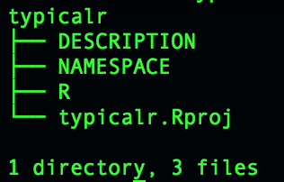
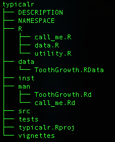
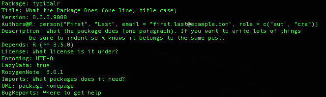
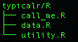
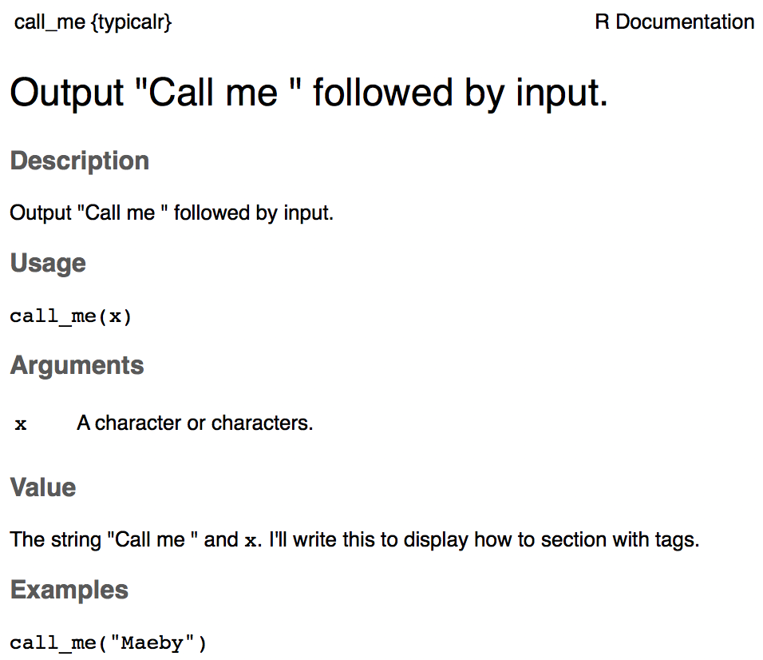
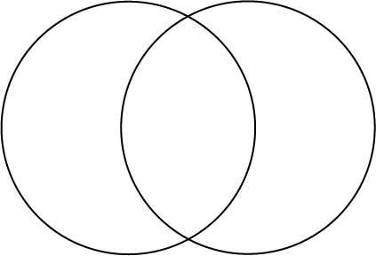

name: Overview
class: spaced

```{r,echo=FALSE,message=FALSE,warning=FALSE,results='hide'}
# run setup code
source("assets/setup.R")
```

```{r,echo=FALSE,message=FALSE,warning=FALSE}
# load the packages you need

#library(tidyverse)
#library(ggplot2) # static graphics
```

# Overview

.pull-left-70[
* [What is an R package?](#rpkg)
<!--* [Possible package states](#pkg-states) -->
<!-- * [Repositories](#)Include? -->
* Package structure:
    + [Metadata | `DESCRIPTION`](#desc)
    + [Code | `r/`](#r)
    + [Documentation | `man/`](#man)
    + [Vignettes](#vig)
    + [Import & Export | `NAMESPACE`](#namespace)
    + [Data | `data/`](#data)
    + [Compiled code | `src/`](#src)
<!--    + [Installed files | `inst/`](#) Include? -->     
<!-- * [Testing](#)  Include? -->
* [git, Github, Rstudio and you!](#git)
* [CRAN and `R CMD check`](#cran)
<!-- * [Package website | `pkgdown`](#)  Include? -->
]

.pull-right-30[

.vsmall[http://r-pkgs.had.co.nz/]
]

???
An overview of the topics I will discuss during the lecture.
"What is an R package" is what should come to mind when thinking an R package.
In package structure ...
"git, github, Rstudio and you" is about why git, github and rstudio are good working environments for package development.
And in "Cran and "R CMD check"" I will talk about tools to check your package and the requirements and pros/cons of submitting it CRAN.

---
name: rpkg

## What is an R package?

.pull-left-50[

]

.pull-right-50[
* A strict and connected folder and file structure
]

???

You can think of an R package under development as a folder and file structure with some predetermined names and connectivity. So really, a package is more about knowing how to organise code and other files than being a good R programmer. There are also some differences in how you write code that is intended to be used for a package than a script for analysis for example. But I will get back to this.  The minimal required package has a DESCRIPTION, a NAMESPACE an R folder for code and here we also see a R project file created by Rstudio which is not required.

---

## What is an R package?

.pull-left-50[


]

.pull-right-50[
* A strict and connected folder and file structure
]

???

There are many additional components you can add to the package, more than are shown here, I will go through the major parts of these in this lecture. So what are R packages for?

---

## What is an R package?

.pull-left-50[


]

.pull-right-50[
* A strict and connected folder and file structure
* Sharing code
* Improved quality and rigor
    + Documentation
    + Tests
    + Examples
* Efficiency
* Improvability
]

???

R packages are for sharing code in a way where others can use it. It also forces the author to include elements which can improve the quality of the code, such as documentation, examples and tests. This is a benefit no matter if the package is intended for other users or not. It really helps when coming back to your own code at a later date. Once you get better at writing packages it may even be more time efficient to write a package even if you are not going to share it.

--

.pull-right-50[
* **Reproducibility**
]

???

Finally; At the moment there is much talk about the reproducibility crisis and creating code in this way is definitely in line with good reproducibility.

---
name: pkg-tips

## Package naming

.pull-left-50[
* A name that describes your packages function
    + Letters, numbers and periods
    + Must start with letter
    + Cannot end with period
* Make it googleable
* Check that it doesn't already exist!
]

<!-- --- -->
<!-- name: pkg-states -->

<!-- ## Possible package states -->

<!-- There are five states a package can exist in: -->
<!-- * Source -->
<!-- * Bundled -->
<!-- * Binary -->
<!-- * Installed -->
<!-- * In-memory -->

<!-- ??? -->

<!-- To help understand what's going on with a package it is useful to know the possible states a package can be in. -->

<!-- --- -->

<!-- ## Source -->

<!-- The development version of your package. The collection of files on your computer. -->

<!-- -- -->

<!-- ## Bundled -->

<!-- * A compressed, tar.gz, source package with vignettes built -->
<!-- * .Rbuildignore files are excluded -->
<!--     + Useful for data for example -->

<!-- ??? -->

<!-- We will get to what vignettes are. -->

<!-- -- -->

<!-- ## Binary -->

<!-- * A bundle that is built for a certain architecture -->
<!-- * Parsed format, skipping the development tools needed to take the package between source and being interpretable by R -->

<!-- ??? -->

<!-- Like the bundled package except that if you uncompressed it doesnt look like the source package. This is because it is built for a certain architecture, or operating system. -->

<!-- --- -->

<!-- ## Installed -->

<!-- * A binary package decompressed into a package library for R -->
<!--     + The package library is the directory or directories where `library(packagename)` searches -->
<!--         + `.libPaths()` -->

<!-- -- -->

<!-- ## In-memory -->

<!-- When you use a package, it is in memory. When developing, a package does not have to be installed to be in memory. -->
<!-- * `packagename::function()` -->
<!--     + loads packagename -->

<!-- Note: -->
<!-- * `library(packagename)` -->
<!--     + loads and attaches packagename -->

<!-- ??? -->

<!-- There is a subtle difference between loading a package into memory to be able to use the functions and also attaching it to the search path so you can use the functions without writing packagename::function(). When you are developing a package it is good to avoid using library and attaching a package because it makes it clearer which package you want the method to come from and having your package attach another package to its search path can mess up your users scripts. -->

<!-- --- -->

<!-- ## Possible package states -->

<!--  -->
<!-- .vsmall[http://r-pkgs.had.co.nz/package.html] -->


<!-- ??? -->

<!-- This image is from Hadleys great introduction to developing packages and I think it illustrates very well how when you run install.packages() from CRAN what is really happening is that it determining what operating system you are on, getting the correct binary version of the package and then, on your device, running R CMD install to put it in your R library. From there you can use the library() command, or not if you are developing, to take it into memory. Whereas if you use type = "source" it will not infer your architecture and grab the bundled source if you will instead. This process will demand that you have the tools on your computer to build the correct binary and install. -->
---
name: desc

## DESCRIPTION



???

Now lets look at the DESCRIPTION file. This file handles the metadata of your package. You can change the name of your package on the top line but remember then to change the folder of your package as they should match.

--

.pull-left-30[
* Title
    + 65 characters, no punctuation
* Version
    + The version of the package

* Description
    + One paragraph

<br>
.footnote[.small[.bold[*]:required]]
]

.pull-right-70[
* Authors@R
    + Roles
        + **cre***: Creator or maintainer.
        + **aut***: Author or authors, have made significant contributions.
        + **ctb**: Contributors, have made smaller contributions.
        + **cph**: Copyright holder. Used if copyright is held by someone other than author, typically company.
]

???

Not all of the fields in DESCRIPTION are important unless you plan to distribute you package to other users.
The title of you package should be a short description, no more than 65 characters.  The author can be one or many people, with names, emails and roles. Every package must have a creator or maintainer and any number of authors, the rest is optional.

---

## DESCRIPTION


.pull-left-50[
* Depends & Imports
    + Packages and versions that your package needs
    + Versions are optional
    + Depends: Attaches!
    + Imports: Loads!
* Suggests
    + Added functionality
* LazyData
    + Datasets occupy no memory until loaded
]

.pull-right-50[
* License
    + Can be a file; LICENSE
    + Influences permissions of who can distribute and modify in what way
    + Most common; MIT, GPL-3, CC0.
    + https://tldrlegal.com/
    + CRAN requires a license

]

???

The Depends and Imports fields of DESCRIPTION handles what packages, and optionally what versions of packages, your package needs to work. The big difference here is that depends attaches the functions, something that is generally frowned upon for packages, and imports loads them, making them available for use. So usually you will see Depends on R version and most other packages in Imports.
Suggests isnt packages that your package needs to function properly but with those packages there can be added functionality. For example a package can create a plot using base R plotting tools but you have built in that if ggplot2 is available create pretties plots instead.
LazyData is a special function which should be true which states that any datasets included in your package should not take any memory until they are used.
The license of your package should reflect who and how your package should be used or modified. If the license is longer than just a standard abbreviation it can be a file, called LICENSE.

---
name: r

## R/

.pull-left-40[

]

???

Now we will start to go through the folders and files in a package to see how they interact, what belongs where and what they do.

---

## R/

.pull-left-40[


]

.pull-right-60[
* Code
    + Large functions in their own R files
    + Utility functions, that your package uses, in one R file
* Bad code
    + `library()`, `require()`, `source()`
    + `options()`, `par()`


]

???

The first folder is the R/ folder. This is where your R code lives. You should try to keep it organized with functions that your user will be using grouped in some R files, and your utility functions in their own R file. Utility functions are functions that you dont expect your user to run, rather they are used by your main functions. If a function doesnt fit in a group or is very large, it can have its own R file, but each function should not have their own R file.
You should avoid using functions in your code that modify the environment of your user. For example if you use library() it will attach the package functions of your user, perhaps getting in the way of other functions he was already using elsewhere. It is better to be explicit then and only load a package into memory. If you change options() or par() settings you should revert them before ending the function so your users environment isnt changed.

<!-- --- -->

<!-- ## Versioning -->

<!-- <center> -->
<!-- .vlarge[0.0.0.9000] -->
<!-- </center> -->

<!-- -- -->

<!-- <center> -->
<!-- .vlarge[major.minor.patch.dev] -->
<!-- </center> -->

<!-- <br><br> -->
<!-- * Major -->
<!--   + Large changes, not always backwards compatible -->
<!--   + Usually 1 upon first release out of dev -->
<!-- * Minor -->
<!--   + Bug fixes & new features. Most common -->
<!-- * Patch -->
<!--   + Small bugfixes, no new features. -->
<!-- * Dev -->
<!--   + Only used while under development -->
<!--   + Always starts at 9000 -->

<!-- ??? -->

<!-- Wether you are developing your package, or updating and adding to a released package, it is good to change the version numbers in your DESCRIPTION file to reflect the changes. The four numbers reflect the kind of change that you have made to the package. Dev should be removed from the package upon release. -->

---
name: man

## man/

.pull-left-30[

]

???

Documentation of your functions is important for helping users know how to use your package, and also for yourself when you come back to the package. The documentation is in the man/ directory in "R documentation", or Rd files. They contain the information you see when you call ?function. While you can write these by hand it is easier and handsomer to have the package roxygen2 generate them for you.

--

.pull-right-70[
* `Roxygen2`
  + ?function
  + Comment block, `#'`, preceding a function
  + Tags, `@tags`, map values
  + No tag for introduction
      + title*
      + description
      + details
  + Special characters `@\%`, escape with `\`
]

.small[*call_me.R*]
```
#' Output "Call me " followed by input.
#'
#' @param x A character or characters.
#' @return The string "Call me " and \code{x}. I'll write this
#'    to display how to section with tags.
#' @examples
#' call_me("Maeby")
call_me <- function(x) {
  paste("Call me ", x, sep="")
}
```


???

Roxygen2 works with special comment blocks in your code, directly before the function you are documenting, to create the Rd files. So you are actually writing your documentation in the same place as your code, the .R file, which is easier than going to another file and updating it. It also reminds you as you update your code to update the documentation in a natural way, and roxygen even deducts some information by itself so it is faster to write documentation.
Here is an example function in call_me.R with the roxygen2 documentation block preceding it. The first line will become the title and also the description if none is given. @param documents the parameter x, @return lets us know what the function returns, and notice the indentation here which I have added to signify how to add multiple rows of text and have them belong together. @examples shows one or many example executions of the code.

---

## man/

.pull-left-60[
.small[
*call_me.R*
```
#' Output "Call me " followed by input.
#'
#' @param x A character or characters.
#' @return The string "Call me " and \code{x}. I'll write this
#'    to display how to section with tags.
#' @examples
#' call_me("Maeby")
call_me <- function(x) {
  paste("Call me ", x, sep="")
}
```]

.small[
*call_me.Rd*
```
% Generated by roxygen2: do not edit by hand
% Please edit documentation in R/call_me.R
\name{call_me}
\alias{call_me}
\title{Output "Call me " followed by input.}
\usage{
call_me(x)
}
\arguments{
\item{x}{A character or characters.}
}
\value{
The string "Call me " and \code{x}. I'll write this
   to display how to section with tags.
}
\description{
Output "Call me " followed by input.
}
\examples{
call_me("Maeby")
}
```]
]

???

So when your documentation is built, roxygen takes the block information and generates a Rd file that looks like this.

--

.pull-right-40[
<br><br>
.small[\>*?call_me*]

]

???
And when you do question mark the function name in R the Rd file is parsed and you get this helpful documentation that I am sure you are all familiar with. I know this is a busy slide but what I hope I have been able to convey to you is that you use the code block in the .R code file which roxygen2 parses to create the Rd file which in turn is what is read when you ask for the documentation of a function in R.


<!-- --- -->

<!-- ## man/ for datasets -->

<!-- .pull-left-30[ -->
<!--  -->
<!-- ] -->

<!-- ??? -->
<!-- We will get to datasets later but while I am talking about documentation you should also document your datasets, if you have any. It is very similar to functional documentation, my dataset is the publicly available ToothGrowth dataset and I have created a R file called data.R where I will add documentation. -->

<!-- -- -->

<!-- .pull-right-70[ -->
<!-- ```{r} -->
<!-- head(ToothGrowth) -->
<!-- ``` -->
<!-- <br><br> -->
<!-- ] -->

<!-- ??? -->
<!-- Here we see the head of the ToothGrowth dataset. -->
<!-- -- -->

<!-- .small[ -->
<!-- *data.R:* -->
<!-- ``` -->
<!-- #' The Effect of Vitamin C on Tooth Growth in Guinea Pigs -->
<!-- #' -->
<!-- #' The response is the length of odontoblasts (cells responsible for tooth growth) -->
<!-- #'   in 60 guinea pigs. Each animal received one of three dose levels of vitamin C -->
<!-- #'   (0.5, 1, and 2 mg/day) by one of two delivery methods, orange juice or ascorbic -->
<!-- #'   acid (a form of vitamin C and coded as VC). -->
<!-- #' -->
<!-- #' @usage ToothGrowth -->
<!-- #' -->
<!-- #' @format A data frame with 60 observations on 3 variables. -->
<!-- #' \describe{ -->
<!-- #'   \item{len}{Tooth length} -->
<!-- #'   \item{supp}{Supplement type (VC or OJ).} -->
<!-- #'   \item{dose}{Dose in milligrams/day} -->
<!-- #' } -->
<!-- #' @source \url{https://www.elsevier.com/books/the-statistics-of-bioassay/bliss/978-1-4832-5662-7} -->
<!-- "ToothGrowth" -->
<!-- ``` -->
<!-- ] -->

<!-- ??? -->
<!-- And here we see the documentation, which I have put in data.R. Just like previously this is then parsed by roxygen2 when I give the command and ToothGrowth.Rd is created. First title, then description, the usage in this case is just the dataset, and the @format describes the data, not @params that described our functions parameters. At the very end we see just the name of the dataset, which lives in ToothGrowth.RData. -->

---
name: vig

## vignettes/

* A more complete guide to your package
  + For user/you
  + Examples and use cases
* `knitr` & `rmarkdown`
  + `knitr`: add r code to markdown
* `vignettes/package-vignette.Rmd`


???
Vignettes are a long-form guide, or manual, to the package that details what the functions in the package can do. It can also show and give examples of what the package is designed to do, using multiple functions in sequence. If functional documentation shows just a part, think of the vignette as a book chapter showing what your package can do. It can look very different if you intend it for your users or for yourself to read at a later date. You can use many things to create the vignette, but like with roxygen2 probably the easiest is to use knitr and rmarkdown.

---
name: namespace

## NAMESPACE

.center[package1 names &emsp; &emsp; &emsp; &emsp; package2 names]
.center[]

???
The namespace makes sure your package works well with other packages, so it is mostly important for submitting to repository, CRAN. It makes sure your code and the code of other packages doesnt interfere with eachother. I like to think of it as a venn diagram, where each circle is a space filled with names. What the namespace does is remove the overlap, so if your function uses a function from package1, it wont accidentally use a function with the same name from package2. It does this by specifying which space a function should look for the name of a function it needs.

--

* `@imports` and `@importsFrom`
  + Defines how/where a function in one package finds a function in another
  + `@imports` *pkg*
  + `@importsFrom` *pkg function*
* `@export`
  + Defines which functions are available to user
  + Do not export data

???
It does this using imports and exports.
Like the other documentation, we can use roxygen2 to create our namespace. Using the imports tag, it doesnt matter if our user has loaded a package with a function with the same name as one of our functions are using, because our function will know to use the one specified in imports. Exports helps by saying that only these functions of my package are available outside. If you export all your functions, it increases the risk of being incompatible with other packages, so good practice is to export as few as possible.
If you are not going to share your package, just export every function.

---

## NAMESPACE

.small[*call_me.R:*]
```
#' Output "Call me " followed by input.
#'
#' @param x A character or characters.
#' @return The string "Call me " and \code{x}. I'll write this
#'    to display how to section with tags.
#' @examples
#' call_me("Maeby")
#' @export
call_me <- function(x) {
  paste("Call me ",x,sep="")
}
```

.small[*utility.R:*]
```
#' @import knitr
NULL
```

???
Revisiting call_me.R, I have now added the @export tag, and in the utility.R I have @import knitr, just as an example, using the NULL object since there has to be something there.

--

.small[*NAMESPACE:*]
```
# Generated by roxygen2: do not edit by hand

export(call_me)
import(knitr)
```


???
So when I run devtools::document(), just like when we generated the other documentation, this will generate the NAMESPACE for us. Notice that this is a very minimal example and roxygen2 actually looks at what you are exporting so there are added benefits here where you are just writing @export but roxygen2 is correctly exporting it as a S3 or S4 class etc.

---

## NAMESPACE

.center.large[Import in **DESCRIPTION** and in **NAMESPACE**!?]

???
A final note on the namespace is that at a glance we are now importing packages both in the DESCRIPTION and in the NAMESPACE. This is more an accident of naming as they are doing a bit different things.

--
<br><br><br><br>
* DESCRIPTION `Imports:`
  + "My package needs this package to work"
* NAMESPACE `@import`
  + "When my package uses this function, use the one from the package in the NAMESPACE"

* Additional effects:
  + NAMESPACE removes need for `::`
      + `package::function()` or `function()`

???
When you import a function in DESCRIPTION you are saying that "My package needs this package to work", when you import a function in NAMESPACE you are saying "When my package uses this function, use the one from the package in the NAMESPACE" even if there exist functions with the same name.
An added benefit is that if you just import a package in DESCRIPTION you need to specify in your code which package it is from as it is not attached but if you import it from NAMESPACE this need is removed.
Finally: Realise that writing package::function() removes the need to import functions to NAMESPACE and is best, but it takes a while to write of course.

---
name: data

## data/

.pull-left-50[
**Package types:**
* Functional
  + Performs a or several functions
  + Contains no or small datasets, <1 MB
* Dataset
  + Contains an interesting dataset
  + Easy to import
  + Few or no functions
]

???
Including data is good if there is some information intrinsic to some of your functions or to provide examples of usage. In some packages it can be the main reason for the package, for example a R package carrying some census data which is easy for people to load. Unless your package is such a data package you should strive to keep it less than 1 MB.

--

.pull-right-50[
**Data types:**
* Binary data, `.Rdata` or `.rda`
    + `data/` folder
    + A single object with the same name as the data file
* Function data
    + `R/sysdata.rda`
    + Data that your functions need
* Raw data, `.xlsx`,`.csv` etc
    + `inst/extdata`folder
]

???
You can have three types of data in R, binary data is an R object saved to data/ directory with the same name as the object. These can be slightly larger files.
Data that your functions need, for example in life sciences you might save the positions of the centromeres within a package that plots the genome, or for a plotting program you may want to save a list of colors, this is usually saved in R/sysdata.rda. The objects saved there will be available to your functions by name within the package.
If you want to include raw data, usually you should try not to or convert it to binary data, you can save those in inst/extdata.

--

.pull-out[
```
#Create data in package automatically
devtools::use_data(object, package)

#Manually
save(object, file="path/to/package/data/object.Rdata")

#Access raw data
system.file("extdata","filename.csv", package="packagename")
```
]

???
Here we see some code where we use devtools, which we will use a lot during the exercise, to save a object directly to data/ directory with the correct name. This is the same thing basically as using the save command and pointing to the correct location, with correct filename. If you want to access data belongning to a package you can use the system.file command in R.

---
name: src

## src/
.pull-left-50[

]

.pull-right-50[
* Compiled code
  + `Rcpp`
  + `rJava`
* Scripts
  + `inst/`
  + Dependencies
]

???
I wont go deeply into this, but I want it to be something you are aware of.
R isnt the fastest language, so sometimes you may want to put for example C or C++ in your package for certain functions. There are two ways to go about this.
Either you can integrate, using packages such as Rcpp, or rJava and others, or you just straight up put code such as .py files in inst/python. This should be avoided as it creates additional dependencies on the user. 

---
name: git
class: spaced

## git, Github, Rstudio and you!

.pull-left-50[
* `git`
  + Version control
  + Working in groups
  + Rstudio integration
* Github
  + Unoffical repository
  + `devtools::install_github()`
  + R Package development environment
  + Issues
]

.pull-right-50[

]

???
That was all I was going to say about the different pieces of a package. There are more but I think those are the main parts and you can dive into the others if you are making an advanced package.
Now let's talk alittle about hosting your package. Using version control, such as git, is a good way to work on your package, especially if you are working on it in a group. This is because it keeps track of changes and conflicts so that if multiple people are working on the same file no bugs appear. You can also setup Rstudio to work with git and github. A package hosted on github can be directly installed using devtools::install_github() and what you see more and more nowadays is that a stable release is on CRAN whereas development versions are on github. It is also a great place for others to contribute to your code and to report issues they have with your package.
We hope that github will continue to be a popular place for R package development now that microsoft has purchased it.

---
name: cran

## CRAN and `R CMD check`

.pull-left-60[
* **C**omprehensive **R** **A**rchive **N**etwork
  + R package repository
  + Sign of quality
* `R CMD check`
  + More than 50 individual checks
  + Three messages:
      + **ERROR**: Always fix.
      + **WARNING**: Should probably fix. Definitely for CRAN submit.
      + **NOTE**: Try to solve to CRAN submit, else do not bother.
  + `devtools::check()`
]

.pull-right-40[

]

???
R CMD check is a command that checks your package for common problems. From filenames and permissions to information in DESCRIPTION and NAMESPACE and wether you can install it. Note that this can only check if it is installable in your current environment, not on other operating systems. It also checks that your package is compatible with CRAN, such as not having the same name as a package that already exists there and that the required the information in DESCRIPTION is present. It also checks your actual code, making sure that there are no problems or dependencies that are not met.
There are three types of messages that R CMD CHECK can complain about. Errors are always bad, and you should fix them no matter what. Warnings are pretty bad, but there may be some false positives. You should try to fix them especially if you are submitting the package to cran. Notes you can take or leave, but if you are a completionist you should aspire to fix even these.
As with most other commands, devtools has a function for this called check() which performs r cmd check and some additional operations such as automatically updating the documentation and bundling the package before checking.

--

.pull-right-40[
<br>

]

.pull-left-60[
* Travis-CI
  + Integrated with your github repository
  + Automates `R CMD check`
  + Multiple operating systems
]

???
If you are developing your package on github you can set up Travis to run this check every time you commit your package. One of the best things is that it tests it for multiple different operating systems.

---
class: spaced

## Summary

.pull-left-70[
* [What is an R package?](#rpkg)
<!--* [Possible package states](#pkg-states) -->
<!-- * [Repositories](#)Include? -->
* Package structure:
    + [Metadata | `DESCRIPTION`](#desc)
    + [Code | `r/`](#r)
    + [Documentation | `man/`](#man)
    + [Vignettes](#vig)
    + [Import & Export | `NAMESPACE`](#namespace)
    + [Data | `data/`](#data)
    + [Compiled code | `src/`](#src)
<!--    + [Installed files | `inst/`](#) Include? -->     
<!-- * [Testing](#)  Include? -->
* [git, Github, Rstudio and you!](#git)
* [CRAN and `R CMD check`](#cran)
<!-- * [Package website | `pkgdown`](#)  Include? -->
]

.pull-right-30[

.vsmall[http://r-pkgs.had.co.nz/]
]

---
name: end-slide
class: end-slide

# Thank you

---
name: session

## Session  

* This presentation was created in RStudio using [`remarkjs`](https://github.com/gnab/remark) framework through R package [`xaringan`](https://github.com/yihui/xaringan).
* For R Markdown, see <http://rmarkdown.rstudio.com>
* For R Markdown presentations, see <https://rmarkdown.rstudio.com/lesson-11.html>

```{r,echo=TRUE}
R.version
```
