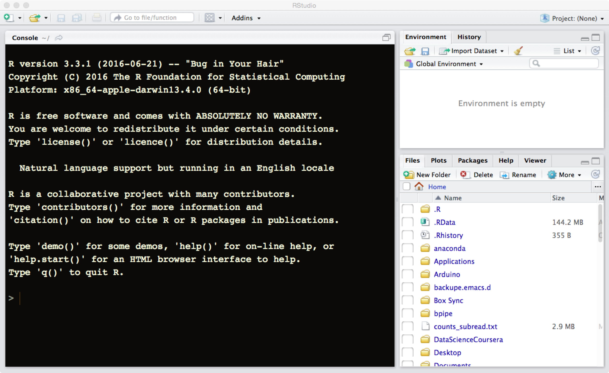

# Pre-course Material

You are not required to have any experience with the R language nor
with the software R-studio to follow the course, but to save time and
get a smooth start we ask everyone to have the latest version of R and
R studio installed on your computer at course start.

# Software needed for the course

For the course we will use the latest version of R and R-studio. Both
of these works on computers running Linux, Windows and Macintosh
operative systems. R-studio is a set of tools as well as an editor
that facilitates the use of R and in many ways create a superior
environment to integrate directly with R. Over the last years it has
become a very popular tool and in many ways become a de-facto standard
for working with R.

Note that on same operative systems it will be easier to install and
run R and R-studio if you are administrator of your own computer and
hence are allowed to install software on your machine. If you do not
have these privileges please ask your system administrator to install
the latest version of R and R-studio.

## Install R

1.  Go to [CRAN](https://cran.rstudio.com)
2.  Click on the link corresponding to your operative system
3.  Download the recommended files for your system.
4.  Run the installer or move the downloaded files to suitable place on
    your computer.

### Details for Windows

Once you clicked on the "Download R for Windows" you will come to a
new web page where you will have a set of options. Click on the first
link named "base". This will take you to the web page entitled "R-3.3.3
for Windows" where you can download the "R-3.3.3-win.exe"
that will can be run to install R on your computer.

### Details for Macintosh

Once you clicked on the "Download R for Macintosh" you will come to a
new web page where you will have a set of options. Unless you have an
old version of your operative system you should select the first link
named "R-3.3.3.pkg" that will download R to your computer. If you are
not sure what version you are running click the apple on the top left
of your screen and select "About this mac" (Om den här datorn). In
case you are running something older than 10.9, you should instead
pick the "R-3.2.1-snowleopard.pkg" to install. Note that this will not
give you the latest version of R, but it will be sufficient for most
sections of the course.

You can then double-click the downloaded package that will prompt you
with some questions for installation details. Stick with the default
settings and you should be fine.

### Details for Linux

Once you clicked on the "Download R for Linux" you will come to a
new web page where you can select the linux version you use. On most
distributions this will be via a software install system like yum or
apt-get. If you run this make sure that you update your information to
the installer first, otherwise you might end up installing at outdated
version of R. For some systems you might need to install not only
r-base, but also r-devel or you will lack important features of your R
installation. 

## Install R-studio

Go to the
web page [rstudio](https://www.rstudio.com/products/rstudio/download/)
download the installer corresponding to your operative system. Unpack
the installer and install the app on a suitable place on your system.

## Test your environment

If the installation above went without any problem you should be able
to fire up R-studio and see something like the following:

If you do not see a screen like this one please send an email to
thomas.kallman@nbis.se describing the error as well which operative operative
system you are running.

# Other tools

To be able to follow in this class we do recommend to use R-studio,
but in case it does not fit your needs all the R code we describe will
of course work irrespective of the environment that you use. The main
benefits of using r-studio is that there are bundled packages with
this software that greatly helps for documenting the R-code that you
use and write.

While this is NOT absolutely necessary, to be able to get the most from the 
part of the course that covers explanatory programming, we advise you to have 
a distribution of LaTeX system installed on your machine so that the R-Studio 
can call it. Please follow guidelines on [LaTeX site](http://www.latex-project.org/get/)

Mac users can follow [this link](https://www.tug.org/mactex/mactex-download.html) 
and installation instructions therein.

Some commonly used tools besides R-studio are:

-   The built in GUI that comes with R.
    Gives the basic functionality and if you are not a heavy R users
    this might be suitable as it comes with the R package.
-   ESS, emacs speaks statistics. If you are already using emacs this
    offers nice possibities to interact with R from emacs. It offers
    nice debugging features as well as support for building packages.
-   Any text editor that you are happy with. This means that you can focus on
    writing your code and then just run the code from within R using
    copy/paste or by submitting all your code as scripts to R.

# Useful R online resources

If you are eager to try things out before the course starts the
following links goes to some useful material on using R.

- [Best first R tutorial](https://www.nceas.ucsb.edu/files/scicomp/Dloads/RProgramming/BestFirstRTutorial.pdf)  
  A nice self learn tutorial to R, introducing many central concepts to R.
- [A short introduction to R](https://cran.r-project.org/doc/contrib/Torfs+Brauer-Short-R-Intro.pdf)  
  A very short intro to using R.
- [An introduction to R](https://cran.r-project.org/doc/manuals/r-release/R-intro.html)  
  A fairly comprehensive document on R. As a beginner one can start
  with Appendix A that is a short practical session. 
- [The art of R programming](http://heather.cs.ucdavis.edu/~matloff/132/NSPpart.pdf)  
  A pdf copy of a book that deals with R as a programming
  language. Is a great source of information for anyone that wants to
  use R not only as a statistical analysis tools, but also use it as a
  more general programming language.
- [R for data science](http://r4ds.had.co.nz)  
  The basics of getting data into R, clean the data do your
  analysis. One of the authors of this book Hadley Wickham is also
  behind R-studio and has published several books on different aspects
  of using R, many of them available for free via his web page. He has
  also created many packages for R that facilitate structured data
  analysis. His most popular packages is ggplot2 for creating beautiful
  graphics with limited set of commands. This is one of the few
  external packages that we will use more extensively in
  class. Besides ggplot2 he has created many other packages that make
  use of novel objects and often use slightly different R syntax to
  interact with them. This means that code using them will look
  different to most other R code. If you like this way of working,
  there is a whole set of packages often referred to as
  the [tidyverse](https://blog.rstudio.org/2016/09/15/tidyverse-1-0-0)
  that offers a more unified interaction with objects and functions
  under this approach to data analysis.

# Useful Non-R specific online resources

- [http://biosupport.se/](http://biosupport.se/)  
  Forum where NBIS and Scilifelab related personal tries to answer
  questions submitted by the community
- [http://www.biostars.org/](http://www.biostars.org/)  
  Online Question and answer resource aimed at bioinformatics
- [http://seqanswers.com/](http://seqanswers.com/)  
  Online forum focusing on analysis of ngs data
- [Stackoverflow](http://stackoverflow.com)  
  Online community for programmers.
  
