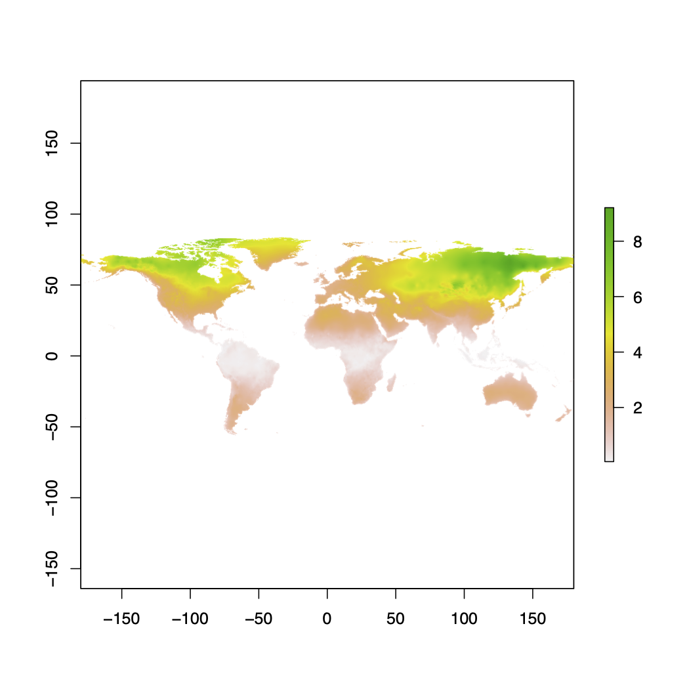
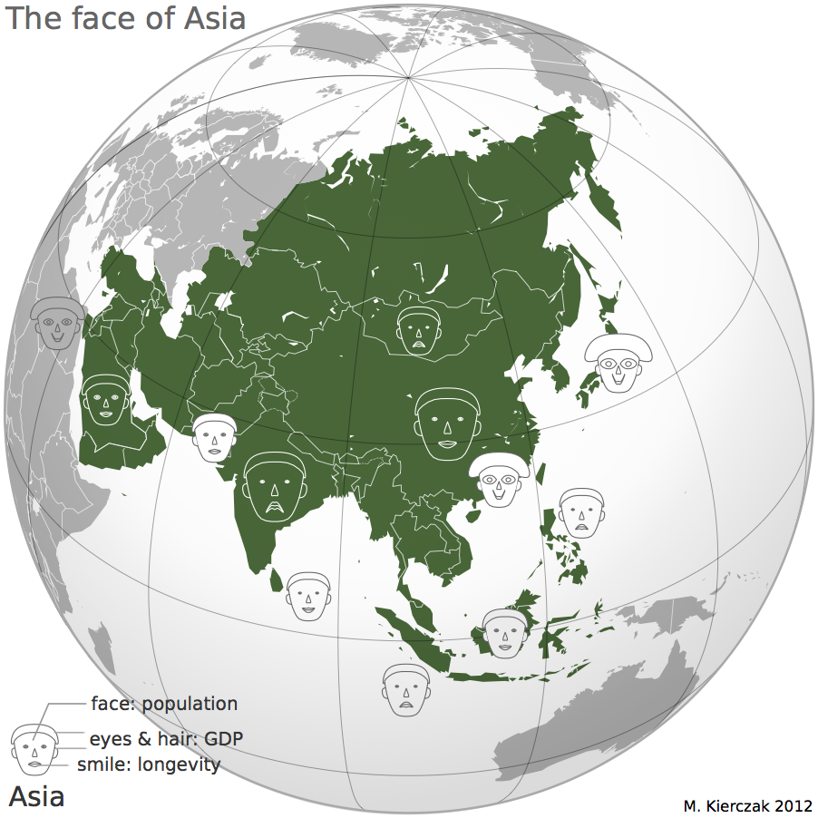
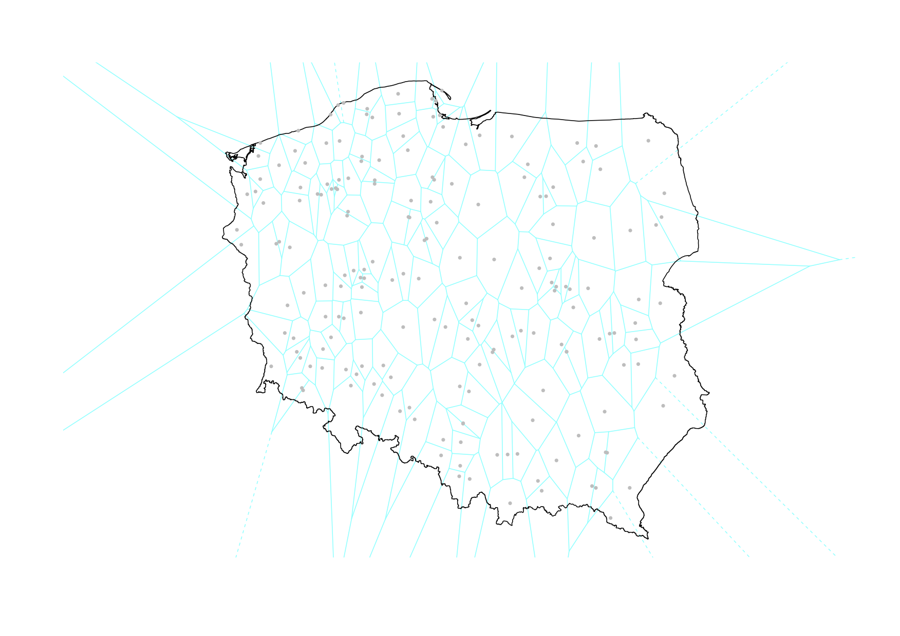
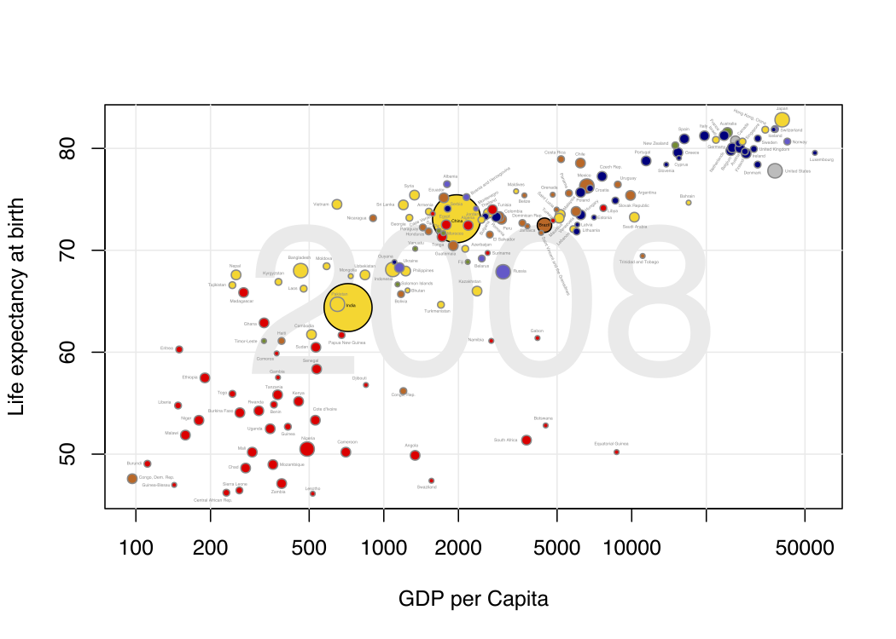
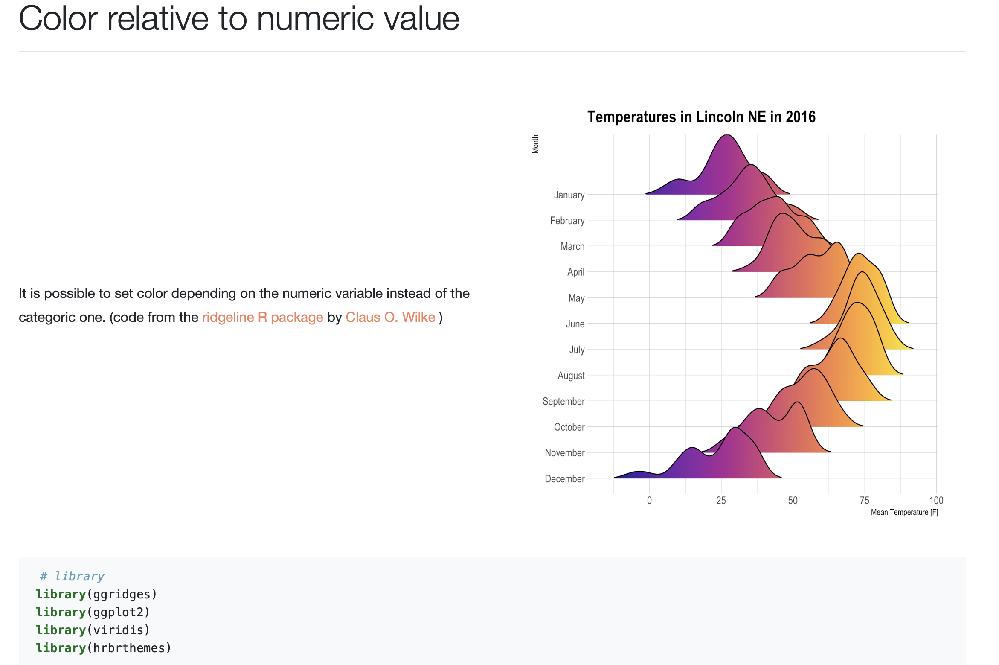

exclude: true
count: false

```{r,echo=FALSE,child="assets/header-slide.Rmd"}
```

<!-- ------------ Only edit title, subtitle & author above this ------------ -->

```{r setup, include=FALSE}
knitr::opts_chunk$set(echo = TRUE, width=60, fig.align = 'center')
```

```{r,echo=FALSE,message=FALSE,warning=FALSE}
# load the packages you need
#library(dplyr)
#library(tidyr)
#library(stringr)
#library(ggplot2)
#library(mkteachr)
```

---
name: ex1_graphics

# Example graphics

.pull-left-50[
.size-80[]

Stability of the climate (courtesy of Dr. Mats Pettersson).
]

--

.pull-right-50[
.size-80[]
]

---
name: ex2_graphics

# Example graphics

.pull-left-50[


]

--

.pull-right-50[

]

---
name: grapgical_devices
class: spaced

# Graphical devices

The concept of a **graphical device** is crucial for understanding R graphics.  

--
A device can be a screen (default) or a file. Some R packages introduce their own devices, e.g. Cairo device.

--
Creating a plot entails:
* opening a graphical device (not necessary for plotting on screen),

--
* plotting to the graphical device,

--
* closing the graphical device (very important!)

--

# The most commonly used graphical devices are:

* screen,
* bitmap/raster devices: `png()`, `bmp()`, `tiff()`, `jpeg()`
* vector devices: `svg()`, `pdf()`,
* `Cairo` versions of the above devices &ndash; for Windows users they offer higher quality graphics,

--
For more information visit [this link](http://stat.ethz.ch/R-manual/R-devel/library/grDevices/html/Devices.html).

---
name: working_with_graphical_devs
class: spaced

# Working with graphical devices

```{r graphdevex, eval=FALSE, tidy=F}
png(filename = 'myplot.png', width = 320, height = 320, antialias = T)
plot(x=c(1,2,7), y=c(2,3,5))
dev.off()
```

--

What we did was, in sequence:

* open a graphical device, here `png()` with some parameters,
* do the actual plotting to the device using `plot()` and
* close the graphical device using `dev.off()`.

--

> It is of paramount importance to remember to close graphical devices. Otherwise, our plots may end up in some random weird files or on screens.

---
name: std_viewport

# Standard graphical device viewport

.size-60[]
.small[source: rgraphics.limnology.wisc.edu]

---
name: plot_basics

# `base::plot()` basics

`base::plot()` is a basic command that lets you visualize your data and results. It is very powerful yet takes some effort to fully master it. Let's begin with plotting three points:

* A(1,2);
* B(2,3);
* C(7,5);

.size-40[
```{r plot1, eval=TRUE}
plot(x=c(1,2,7), y=c(2,3,5))
```
]

---
name: plot_data_frame

# Anatomy of a plot &mdash; episode 1

For convenience, we will create a data frame with our points:

.pull-left-50[
```{r plot1a, eval=TRUE, tidy=TRUE}
df <- data.frame(x=c(1,2,7), y=c(2,3,5),
row.names=c("A","B","C"))
df
```
]

.pull-right-50[
```{r, echo=TRUE}
plot(df)
```
]

---
name: plot_anatomy_2

# Anatomy of a plot &mdash; episode 2

.pull-left-50[
There is many parameters one can set in `plot()`. Let's have a closer look at some of them:
* pch &ndash; type of the plotting symbol
* col &ndash; color of the points
* cex &ndash; scale for points
* main &ndash; main title of the plot
* sub &ndash; subtitle of the plot
* xlab &ndash; X-axis label
* ylab &ndash; Y-axis label
* las &ndash; axis labels orientation
* cex.axis &ndash; axis lables scale
]

.pull-right-50[
Let's make our plot a bit fancier...
```{r plot2, eval=TRUE, tidy=TRUE}
plot(df, pch=c(15,17,19),
col=c("tomato", "slateblue"), # recycling rule in action!
main="Three points", sub="Stage 1")
```
]

---
name: gr_param

# Graphical parameters

Graphical parameters can be set in two different ways:

* as plotting function arguments, e.g. `plot(dat, cex = 0.5)`
* using `par()` to set parameters globally

```{r gr.params, eval=TRUE, tidy=FALSE, eval=F}
# read current graphical parameters
par()
# first, save the current parameters so that you
# can set them back if needed
old_par <- par() # should work in theory, practise varies :-(
# now, modify what you want
par(cex.axis = 0.8, bg='grey')
# do your plotting
plot(................)
# restore the old parameters if you want
par(old_par)
```

---
name: pch_plot

# The `pch` parameter

.size-80[
```{r par.pch, echo=F, tidy=F}
# create a grid of coordinates
coords <- expand.grid(1:6,1:6)
# make a vector of numerical pch symbols
pch.num <- c(0:25)
# and a vector of character pch symbols
pch.symb <- c('*', '.', 'o', 'O', '0', '-', '+', '|', '%', '#')
# plot numerical pch
plot(coords[1:26,1], coords[1:26,2], pch=pch.num,
bty='n', xaxt='n', yaxt='n', bg='red',
xlab='', ylab='')
# and character pch's
points(coords[27:36,1], coords[27:36,2], pch=pch.symb, cex=3)
# label them
text(coords[,1], coords[,2], c(1:26, pch.symb), pos = 1,
col='slateblue', cex=.8)
```
]

---
name: pch_cheatsheet_code

# How to make the `pch` cheatsheet

```{r par.pch2, echo=T, tidy=F, eval=F}
# create a grid of coordinates
coords <- expand.grid(1:6,1:6)
# make a vector of numerical pch symbols
pch.num <- c(0:25)
# and a vector of character pch symbols
pch.symb <- c('*', '.', 'o', 'O', '0', '-', '+', '|', '%', '#')
# plot numerical pch
plot(coords[1:26,1], coords[1:26,2], pch=pch.num,
bty='n', xaxt='n', yaxt='n', bg='red',
xlab='', ylab='')
# and character pch's
points(coords[27:36,1], coords[27:36,2], pch=pch.symb)
# label them
text(coords[,1], coords[,2], c(1:26, pch.symb), pos = 1,
col='slateblue', cex=.8)
```
> Now, make your own cheatsheet for the **lty** parameter!

---
name: layers_1

# Layers

Elements are added to a plot in the same order you plot them.
It is like layers in a graphical program. Think about it! For instance the auxiliary grid lines should be plotted before the actual data points.

.pull-left-50[
```{r gr.layers, eval=TRUE, tidy=T, eval=F}
# make an empty plot
plot(1:5, type='n', las=1, bty='n')
grid(col='grey', lty=3)
points(1:5, pch=19, cex=3)
abline(h = 3.0, col='red')
```
]
.pull-right-50[
```{r gr.layers.ex, eval=TRUE, tidy=T, eval=T, echo=F}
plot(1:5, type='n', las=1, bty='n')
grid(col='grey', lty=3)
points(1:5, pch=19, cex=3)
abline(h = 3.0, col='red')
```
]
The line overlaps one data point. It is better to plot it before plotting `points()`

---
name: general_thoughts
class: spaced

# Some thoughts about plotting

There is a few points you should have in mind when working with plots:

--
* raster or vector graphics,

--
* colors, e.g. color-blind people, warm vs. cool colors and optical illusions,

--
* avoid complications, e.g. 3D plots, pie charts etc.,

--
* use black and shades of grey for things you do not need to emphasize, i.e. basically everything except your main result,

--
* avoid 3 axes on one figure.

---
name: many_plots_on_one_fig

# Many plots on one figure

.pull-left-40[
```{r mfrow,  tidy=FALSE, echo=T, eval=F}
par(mfrow=c(2,3))
plot(1:5)
plot(1:5, pch=19, col='red')
plot(1:5, pch=15, col='blue')
hist(rnorm(100, mean = 0, sd=1))
hist(rnorm(100, mean = 7, sd=3))
hist(rnorm(100, mean = 1, sd=0.5))
par(mfrow=c(1,1))
```
Alternative: use `par(mfcol=c(3,2))`.
]

--

.pull-right-60[
```{r mfrow.ex,  tidy=FALSE, echo=F, eval=T}
par(mfrow=c(2,3))
plot(1:5)
plot(1:5, pch=19, col='red')
plot(1:5, pch=15, col='blue')
hist(rnorm(100, mean = 0, sd=1))
hist(rnorm(100, mean = 7, sd=3))
hist(rnorm(100, mean = 1, sd=0.5))
par(mfrow=c(1,1))
```
]

---
name: layout

# Using `graphics::layout()`

.pull-left-50[
```{r layout, echo=T, eval=T, fig.show='hide'}
M <- matrix(c(1,2,2,2,3,2,2,2), nrow = 2, ncol = 4, byrow = T)
layout(mat = M)
plot(1:5, pch=15, col='blue')
hist(rnorm(100, mean = 0, sd=1))
plot(1:5, pch=15, col='red')
M
```
]

--

.pull-right-50[
```{r layout_ex, echo=T, eval=T}
M <- matrix(c(1,2,2,2,3,2,2,2), nrow = 2, ncol = 4, byrow = T)
layout(mat = M)
plot(1:5, pch=15, col='blue')
hist(rnorm(100, mean = 0, sd=1))
plot(1:5, pch=15, col='red')
```
]

---
name: colors

# Defining colors

```{r color, echo=T, tidy=T, eval=F}
mycol <- c(rgb(0,0,1), 'olivedrab', '#FF0000')
plot(1:3,c(1,1,1), col=mycol, pch=19, cex=3)
points(2,1, col=rgb(0,0,1,0.5), pch=15, cex=5)
```

--
```{r color_ex, echo=F, tidy=T, eval=T, fig.align='center', fig.height=5, fig.width=5}
mycol <- c(rgb(0,0,1), 'olivedrab', '#FF0000')
plot(1:3,c(1,1,1), col=mycol, pch=19, cex=3, las=1)
points(2,1, col=rgb(0,0,1,0.5), pch=15, cex=5)
```

---
name: palettes

# Color palettes

There some built-in palettes: default, hsv, gray, rainbow, terrain.colors, topo.colors, cm.colors, heat.colors
```{r color.pal, echo=T, tidy=T, size='tiny', fig.align='center', fig.width=5, fig.height=4}
mypal <- heat.colors(10)
mypal
pie(x = rep(1, times = 10), col = mypal)
```

---
name: custom_palettes

# Custom color palettes

.pull-left-50[
You can easily create custom palettes:
```{r color.pal.custom, echo=T, tidy=T, eval=T}
mypal <- colorRampPalette(c("red", "green", "blue"))
pie(x = rep(1, times = 12), col = mypal(12))
class(mypal)
```
]

--

.pull-right-50[
> **Note:**`grDevices::colorRampPalette()` returns a function for generating colors based on the defined custom palette!

> There is an excellent package `RColorBrewer` that offers a number of pre-made palettes, e.g. color-blind safe palette.

> Package `wesanderson` offers palettes based on Wes Anderson's movies :-)
]

---
name: boxplot_theory

# Box-and-whiskers plot &mdash; theory

There are also more specialized R functions used for creating specific types of plots. One commonly used is `graphics::boxplot()`
.size-40[.center[]]

> **Rule of thumb.** If median of one boxplot is outside the box of another, the median difference is likely to be significant $\alpha = 5\%$.

---
name: boxplot

# Box-and-whiskers plot

.pull-left-50[
```{r boxplot, tidy=FALSE}
boxplot(decrease ~ treatment,
data = OrchardSprays,
log = "y", col = "bisque",
varwidth=T)
```
]

--

.pull-right-50[
The `add=TRUE` parameter in plots allows you to compose plots using previously plotted stuff!

```{r boxplot2, tidy=FALSE, size="tiny", fig.height=4, fig.width=4}
attach(InsectSprays)
boxplot(count~spray, data=InsectSprays[spray %in% c("C","F"),], col="lightgray")
boxplot(count~spray, data=InsectSprays[spray %in% c("A","B"),], col="tomato", add=T)
boxplot(count~spray, data=InsectSprays[spray %in% c("D","E"),], col="slateblue", add=T)
detach(InsectSprays)
```
]

---
name: vioplot

# Violin plots

Package `vioplot` empowers your graphics repertoire with a variation of box-and-whiskers plot called *violin plot*.  

```{r vioplot, tidy=FALSE, message=F, warning=F, fig.height=4, fig.width=4}
attach(InsectSprays)
vioplot::vioplot(count[spray=="A"],
count[spray=="F"],
col="bisque",
names=c("A","F"))
detach(InsectSprays)
```
> A violin plot is very similar to a boxplot, but it also visualizes distribution of your datapoints.

---
name: vcd

# Plotting categorical data

```{r vcd.titanic,  tidy=FALSE, fig.height=4, fig.width=6, size='tiny', echo=T}
data(Titanic) # Load the data
vcd::mosaic(Titanic,
            labeling = vcd::labeling_border(rot_labels = c(0,0,0,0)))
```
> Package `vcd` provides a lot of ways of visualizing categorical data.

---
name: heatmaps

# Plotting simple heatmaps

```{r heatmap,  tidy=FALSE, echo=T, fig.width=5, fig.height=5}
heatmap(matrix(rnorm(100, mean = 0, sd = 1), nrow = 10),
col=terrain.colors(10))
```

---
name: graph_gallery

# Graph gallery

For more awesome examples visit: [http://www.r-graph-gallery.com](http://www.r-graph-gallery.com)



<!-- --------------------- Do not edit this and below --------------------- -->

---
name: end_slide
class: end-slide, middle
count: false

# Thank you! Questions?

```{r,echo=FALSE,child="assets/footer-slide.Rmd"}
```

```{r,include=FALSE,eval=FALSE}
# manually run this to render this document to HTML
#rmarkdown::render("presentation_demo.Rmd")
# manually run this to convert HTML to PDF
#pagedown::chrome_print("presentation_demo.html",output="presentation_demo.pdf")
```
