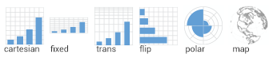

exclude: true
count: false

```{r,echo=FALSE,child="assets/header-slide.Rmd"}
```

<!-- ----------------- Only edit title & author above this ----------------- -->

```{r,echo=FALSE,message=FALSE,warning=FALSE}
# load packages
library(dplyr)
library(tidyr)
library(ggplot2)
library(gridExtra)

#colors
rv_col_dark <- "#125687"
rv_col_light <- "#e7eef3"

```

## Contents

* [Why `ggplot2`?](#intro)
* [Grammar of Graphics](#gog)
* [Data](#data-iris)
* [Geoms](#geom)
* [Aesthetics](#aes)
* [Scales](#scales-discrete-colour)
* [Facets](#facet-wrap)
* [Coordinates](#coordinate)
* [Theme](#theme)
* [Position](#position)
* [Saving Plots](#save)
* [Combining Plots](#comb)
* [Interactive Plots](#interactive)
* [Extensions](#extension)

---
name: intro
class: spaced 

## Why `ggplot2`?

* Consistent code
* Flexible
* Automatic legends, colors etc
* Save plot objects
* Themes for reusing styles
* Numerous add-ons/extensions
* Nearly complete graphing solution

--

Not suitable for:

* 3D graphics

???

Why can't we just do everything is base plot? Of course, we could, but it's easier, consistent and more structured using `ggplot2`. There is bit of a learning curve, but once the code syntax and graphic building logic is clear, it becomes easy to plot a large variety of graphs.

---
name: gvb1

## `ggplot2` vs Base Graphics

.pull-left-50[
```{r,fig.height=4.5,fig.width=4}
hist(iris$Sepal.Length)
```
]

.pull-right-50[
```{r,fig.height=4,fig.width=4}
library(ggplot2)
ggplot(iris,aes(x=Sepal.Length))+
  geom_histogram(bins=8)
```
]

???

For simple graphs, the base plot seem to take minimal coding effort compared to a ggplot graph.

---
name: gvb2

## `ggplot2` vs Base Graphics

.pull-left-50[
```{r,fig.height=4.5,fig.width=4}
plot(iris$Petal.Length,iris$Petal.Width,
     col=c("red","green","blue")[iris$Species],
     pch=c(0,1,2)[iris$Species])
legend(x=1,y=2.5,
       legend=c("setosa","versicolor","virginica"),
       pch=c(0,1,2),col=c("red","green","blue"))
```
]

.pull-right-50[
```{r,fig.height=4,fig.width=5}
ggplot(iris,aes(Petal.Length,Sepal.Length,color=Species))+
  geom_point()
```
]

???

For anything beyond extremely basic plots, base plotting quickly become complex. More importantly, base plots do not have consistency in it's functions or plotting strategy.

---
name: gog
class: spaced

## Grammar Of Graphics

.pull-left-30[


]

--

.pull-right-70[
* **Data**: Input data
* **Geom**: A geometry representing data. Points, Lines etc
* **Aesthetic**: Visual characteristics of the geometry. Size, Color, Shape etc
* **Scale**: How visual characteristics are converted to display values
* **Statistics**: Statistical transformations. Counts, Means etc
* **Coordinates**: Numeric system to determine position of geometry. Cartesian, Polar etc
* **Facets**: Split data into subsets
]

???

`ggplot` was created by Hadley Wickham in 2005 as an implementation of Leland Wilkinson's book Grammar of Graphics.

Different graphs have always been considered as independent entities and also labelled differently such as barplots, scatterplots, boxplots etc. Each graph has it's own function and plotting strategy.

Grammar of graphics (GOG) tries to unify all graphs under a common umbrella. GOG brings the idea that graphs are made up of discrete components which can be mixed and matched to create any plot. This creates a consistent underlying framework to graphing.

---
name: syntax

## Building A Graph: Syntax


---
name: build-1

## Building A Graph

.pull-left-40[
```{r,fig.height=3.5,fig.width=3.5,eval=FALSE}
ggplot(iris)
```
]

.pull-right-50[
```{r,fig.height=3.5,fig.width=3.5,echo=FALSE}
data(iris)
ggplot(iris)
```
]

---
name: build-2

## Building A Graph

.pull-left-40[
```{r,fig.height=3.5,fig.width=3.5,eval=FALSE}
ggplot(iris,aes(x=Sepal.Length,
                y=Sepal.Width))
```
]

.pull-right-50[
```{r,fig.height=3.5,fig.width=3.5,echo=FALSE}
ggplot(iris,aes(x=Sepal.Length,
                y=Sepal.Width))
```
]

---
name: build-3

## Building A Graph

.pull-left-40[
```{r,fig.height=3.5,fig.width=3.5,eval=FALSE}
ggplot(iris,aes(x=Sepal.Length,
                y=Sepal.Width))+
  geom_point()
```
]

.pull-right-50[
```{r,fig.height=3.5,fig.width=3.5,echo=FALSE}
ggplot(iris,aes(x=Sepal.Length,
                y=Sepal.Width))+
  geom_point()
```
]

---
name: build-4

## Building A Graph

.pull-left-40[
```{r,fig.height=3.5,fig.width=3.5,eval=FALSE}
ggplot(iris,aes(x=Sepal.Length,
                y=Sepal.Width,
                colour=Species))+
  geom_point()
```
]

.pull-right-50[
```{r,fig.height=3.5,fig.width=3.5,echo=FALSE}
ggplot(iris,aes(x=Sepal.Length,
                y=Sepal.Width,
                colour=Species))+
  geom_point()
```
]

---
name: data-iris

## Data • `iris`

* Input data is always an R `data.frame` object


```{r,echo=FALSE}
iris %>% 
  head(n=3) %>%
  kable("html",escape=F,align="c")
```

```{r}
str(iris)
```

???

It's a good idea to use `str()` to check the input dataframe to make sure that numbers are actually numbers and not characters, for example. Verify that factors are correctly assigned.

---
name: data-diamonds

## Data • `diamonds`

```{r,echo=FALSE}
head(diamonds,n=3) %>% 
  na.omit() %>%
  kable("html",escape=F,align="c")
```

```{r}
str(diamonds)
```

???

R `data.frame` is a tabular format with rows and columns just like a spreadsheet. All items in a row or a column must be available or missing values filled in as NAs.

---
name: data-format

## Data • Format

* Transforming data into long or wide formats

```{r,comment=""}
iris %>% head(n=4)
```

```{r,comment=""}
iris %>% tidyr::pivot_longer(!Species,names_to="variable",values_to="value") %>% head(n=4)
```

???

The data must be cleaned up and prepared for plotting. The data must be 'tidy'. Columns must be variables and rows must be observations. The data can then be in wide or long format depending on the variables to be plotted.

---
name: geom

## Geoms


--
```{r,eval=FALSE}
p <- ggplot(iris)
# scatterplot
p+geom_point(aes(x=Sepal.Length,y=Sepal.Width))
# barplot
p+geom_bar(aes(x=Sepal.Length))
# boxplot
p+geom_boxplot(aes(x=Species,y=Sepal.Width))
# search
help.search("^geom_",package="ggplot2")
```

???

Geoms are the geometric components of a graph such as points, lines etc used to represent data. The same data can be visually represented in different geoms. For example, points or bars. Mandatory input requirements change depending on geoms.

---
name: aes

## Aesthetics

* Aesthetic mapping vs aesthetic parameter

.pull-left-50[
```{r,fig.height=4,fig.width=5.5}
ggplot(iris)+
  geom_point(aes(x=Sepal.Length,
                 y=Sepal.Width,
                 size=Petal.Length,
                 alpha=Petal.Width,
                 shape=Species,
                 color=Species))
```
]

.pull-left-50[
```{r,fig.height=3.8,fig.width=3.8}
ggplot(iris)+
  geom_point(aes(x=Sepal.Length,
                 y=Sepal.Width),
                 size=2,
                 alpha=0.8,
                 shape=15,
                 color="steelblue")
```
]

???

Aesthetics are used to assign values to geometries. For example, a set of points can be a fixed size or can be different colors or sizes denoting a variable.

This would be an incorrect way to do it.

```
ggplot(iris)+
geom_point(aes(x=Sepal.Length,y=Sepal.Width,size=2)
```

---
name: aes-2

## Aesthetics

```{r,echo=TRUE,fig.height=4,fig.width=8}
x1 <- ggplot(iris) + 
  geom_point(aes(x=Sepal.Length,y=Sepal.Width))+
  stat_smooth(aes(x=Sepal.Length,y=Sepal.Width))

x2 <- ggplot(iris,aes(x=Sepal.Length,y=Sepal.Width))+ 
                      geom_point() + geom_smooth()

grid.arrange(x1,x2,nrow=1,ncol=2)
```

???

If the same aesthetics are used in multiple geoms, they can be moved to `ggplot()`.

---
name: multiple-geom

## Multiple Geoms

```{r,fig.height=4.7,fig.width=9}
ggplot(iris,aes(x=Sepal.Length,y=Sepal.Width))+
      geom_point()+
      geom_line()+
      geom_smooth()+
      geom_rug()+
      geom_step()+
      geom_text(data=subset(iris,iris$Species=="setosa"),aes(label=Species))
```

???

Multiple geoms can be plotted one after the other. The order in which items are specified in the command dictates the plotting order on the actual plot.

In this case, the points appear over the lines.

```
ggplot(iris,aes(x=Sepal.Length,y=Sepal.Width))+
      geom_point()+
      geom_line()+
```

while here the lines appear above the points.

```
ggplot(iris,aes(x=Sepal.Length,y=Sepal.Width))+
      geom_line()+
      geom_point()+
```

Each geom takes input from `ggplot()` inputs. If extra input is required to a geom, it can be specified additionally inside `aes()`. 

`data` can be changed if needed for specific geoms.

---
name: scales-discrete-color

## Scales • Discrete Colors

* scales: position, color, fill, size, shape, alpha, linetype
* syntax: `scale_<aesthetic>_<type>`


--

.pull-left-50[
```{r,fig.height=2.4,fig.width=4}
p <- ggplot(iris)+geom_point(aes(x=Sepal.Length,
                     y=Sepal.Width,color=Species))
p
```
]

--

.pull-right-50[
```{r,fig.height=2.4,fig.width=4}
p + scale_color_manual(
     name="Manual",
     values=c("#5BC0EB","#FDE74C","#9BC53D"))
```
]

???

Scales are used to control the aesthetics. For example the aesthetic color is mapped to a variable `x`. The palette of colors used, the mapping of which color to which value, the upper and lower limit of the data and colors etc is controlled by scales.

---
name: scales-continuous-color

## Scales • Continuous Colors

* In RStudio, type `scale_`, then press **TAB**

--

.pull-left-50[
```{r,fig.height=4,fig.width=5}
p <- ggplot(iris)+
      geom_point(aes(x=Sepal.Length,
                     y=Sepal.Width,
      shape=Species,color=Petal.Length))
p
```
]

--

.pull-right-50[
```{r,fig.height=4,fig.width=5}
p + 
scale_color_gradient(name="Pet Len",
  breaks=range(iris$Petal.Length),
  labels=c("Min","Max"),
  low="black",high="red")
              
```
]

???

Continuous colours can be changed using `scale_color_gradient()` for two colour gradient. Any number of breaks and colours can be specified using `scale_color_gradientn()`.  

---
name: scales-shape

## Scales • Shape

.pull-left-50[
```{r,fig.height=4,fig.width=5}
p <- ggplot(iris)+
      geom_point(aes(x=Sepal.Length,
                     y=Sepal.Width,
      shape=Species,color=Species))
p
```
]

--

.pull-right-50[
```{r,fig.height=4,fig.width=5}
p + 
scale_color_manual(name="New",
   values=c("blue","green","red"))+
scale_shape_manual(name="Bla",values=c(0,1,2))
              
```
]

???

Shape scale can be adjusted using `scale_shape_manual()`. Multiple mappings for the same variable groups legends.

---
name: scales-axis

## Scales • Axes

* scales: x, y
* syntax: `scale_<axis>_<type>`
* arguments: name, limits, breaks, labels

--

.pull-left-50[
```{r,fig.height=4,fig.width=5}
p <- ggplot(iris)+
      geom_point(aes(x=Sepal.Length,
                     y=Sepal.Width))
p
```
]

--

.pull-right-50[
```{r,fig.height=4,fig.width=5}
p + scale_color_manual(name="New",
   values=c("blue","green","red"))+
scale_x_continuous(name="Sepal Length",
        breaks=seq(1,8),limits=c(3,5))
```
]

???

The x and y axes are also controlled by scales. The axis break points, the break point text and limits are controlled through scales.

When setting limits using `scale_`, the data outside the limits are dropped. Limits can also be set using `lims(x=c(3.5))` or `xlim(c(3,5))`. When mapping, `coord_map()` or `coord_cartesian()` is recommended for setting limits.

---
name: facet-wrap

## Facets • `facet_wrap`

* Split to subplots based on variable(s)
* Facetting in one dimension

--

.pull-left-50[
```{r,fig.height=4,fig.width=5}
p <- ggplot(iris)+
      geom_point(aes(x=Sepal.Length,
                     y=Sepal.Width,
                     color=Species))
p
```
]

--

.pull-right-50[
```{r,fig.height=2.1,fig.width=4.5}
p + facet_wrap(~Species)
```

```{r,fig.height=2.1,fig.width=4.5}
p + facet_wrap(~Species,nrow=3)
```
]

???

`facet_wrap` is used to split a plot into subplots based on the categories in one or more variables. 

---
name: facet-grid

## Facets • `facet_grid`

* Facetting in two dimensions

.pull-left-50[
```{r,fig.height=3.5,fig.width=5}
p <- diamonds %>%
     ggplot(aes(carat,price))+
     geom_point()
p + facet_grid(~cut+clarity)
```
]

--

.pull-left-50[
```{r,fig.height=4,fig.width=5}
p + facet_grid(cut~clarity)
```
]

???

`facet_grid` is also used to split a plot into subplots based on the categories in one or more variables. `facet_grid` can be used to create a matrix-like grid of two variables.

---
name: coordinate

## Coordinate Systems



* `coord_cartesian(xlim=c(2,8))` for zooming in
* `coord_map` for controlling limits on maps
* `coord_polar`

.pull-left-50[
```{r,fig.height=3,fig.width=4}
p <- ggplot(iris,aes(x="",y=Petal.Length,fill=Species))+
  geom_bar(stat="identity")
p
```
]

???

The coordinate system defines the surface used to represent numbers. Most plots use the cartesian coordinate sytem. Pie charts for example, is a polar coordinate projection of a cartesian barplot. Maps for example can have numerous coordinate systems called map projections. For example; UTM coordinates.

--

.pull-right-50[
```{r,fig.height=3.6,fig.width=4.4}
p+coord_polar("y",start=0)
```
]

---
name: theme

## Theme

* Modify non-data plot elements/appearance
* Axis labels, panel colors, legend appearance etc
* Save a particular appearance for reuse
* `?theme`

--

.pull-left-50[
```{r,fig.height=3.6,fig.width=4}
ggplot(iris,aes(Petal.Length))+
  geom_histogram()+
  facet_wrap(~Species,nrow=2)+
  theme_grey()
```
]

--

.pull-right-50[
```{r,fig.height=3.6,fig.width=4}
ggplot(iris,aes(Petal.Length))+
  geom_histogram()+
  facet_wrap(~Species,nrow=2)+
  theme_bw()
```
]

???

Themes allow to modify all non-data related components of the plot. This is the visual appearance of the plot. Examples include the axes line thickness, the background color or font family.

---
name: theme-legend

## Theme • Legend

```{r,fig.height=3,fig.width=4}
p <- ggplot(iris)+
      geom_point(aes(x=Sepal.Length,
                     y=Sepal.Width,
                     color=Species))
```

.pull-left-50[
```{r,fig.height=4,fig.width=4}
p + theme(legend.position="top")
```
]

.pull-right-50[
```{r,fig.height=4,fig.width=4}
p + theme(legend.position="bottom")
```
]

---
name: theme-text

## Theme • Text

```{r,eval=FALSE}
element_text(family=NULL,face=NULL,color=NULL,size=NULL,hjust=NULL,
             vjust=NULL, angle=NULL,lineheight=NULL,margin = NULL)
```

```{r,echo=FALSE}
p <- diamonds %>%
      filter(cut=="Fair"|cut=="Good",color=="D"|color=="E") %>%
      droplevels() %>%
      ggplot(aes(carat,price,alpha=color,shape=cut))+
            geom_point()+
            labs(title="Title",subtitle="subtitle")+
            facet_grid(cut~color)
```

```{r}
p <- p + theme(
    axis.title=element_text(color="#e41a1c"),
    axis.text=element_text(color="#377eb8"),
    plot.title=element_text(color="#4daf4a"),
    plot.subtitle=element_text(color="#984ea3"),
    legend.text=element_text(color="#ff7f00"),
    legend.title=element_text(color="#ffff33"),
    strip.text=element_text(color="#a65628")
)
```

```{r,fig.height=3.7,fig.width=9,echo=FALSE}
dfr <- data.frame(value=rep(1,7),label=c("axis.title","axis.text","plot.title","plot.subtitle","legend.text","legend.title","strip.text"),stringsAsFactors=FALSE) %>%
  mutate(label=factor(label,levels=c("axis.title","axis.text","plot.title","plot.subtitle","legend.text","legend.title","strip.text")))

q <- ggplot(dfr,aes(x=label,y=value,fill=label))+
  geom_bar(stat="identity")+
  labs(x="",y="")+
  coord_flip()+
  scale_fill_manual(values=c("#e41a1c","#377eb8","#4daf4a","#984ea3","#ff7f00","#ffff33","#a65628"))+
  theme_minimal(base_size=20)+
  theme(
    legend.position="none",
    axis.text.x=element_blank(),
    axis.ticks=element_blank(),
    panel.grid=element_blank())

grid.arrange(p,q,nrow=1)
```

---
name: theme-rect

## Theme • Rect

```{r,eval=FALSE}
element_rect(fill=NULL,color=NULL,size=NULL,linetype=NULL)
```

```{r,echo=FALSE}
p <- diamonds %>%
      filter(cut=="Fair"|cut=="Good",color=="D"|color=="E") %>%
      droplevels() %>%
      ggplot(aes(carat,price,alpha=color,shape=cut))+
            geom_point()+
            labs(title="Title",subtitle="subtitle")+
            facet_grid(cut~color)
```

```{r}
p <- p + theme(
    plot.background=element_rect(fill="#b3e2cd"),
    panel.background=element_rect(fill="#fdcdac"),
    panel.border=element_rect(fill=NA,color="#cbd5e8",size=3),
    legend.background=element_rect(fill="#f4cae4"),
    legend.box.background=element_rect(fill="#e6f5c9"),
    strip.background=element_rect(fill="#fff2ae")
)
```

```{r,fig.height=3.7,fig.width=9,echo=FALSE}
dfr <- data.frame(value=rep(1,6),label=c("plot.background","panel.background","panel.border","legend.background","legend.box.background","strip.background"),stringsAsFactors=FALSE) %>%
  mutate(label=factor(label,levels=c("plot.background","panel.background","panel.border","legend.background","legend.box.background","strip.background")))

q <- ggplot(dfr,aes(x=label,y=value,fill=label))+
  geom_bar(stat="identity")+
  labs(x="",y="")+
  coord_flip()+
  scale_fill_manual(values=c("#b3e2cd","#fdcdac","#cbd5e8","#f4cae4","#e6f5c9","#fff2ae"))+
  theme_minimal(base_size=20)+
  theme(
    legend.position="none",
    axis.text.x=element_blank(),
    axis.ticks=element_blank(),
    panel.grid=element_blank())

grid.arrange(p,q,nrow=1)
```

---
name: theme-save

## Theme • Reuse

```{r,echo=FALSE}
p <- diamonds %>%
      filter(cut=="Fair"|cut=="Good"|cut=="Very Good") %>%
      droplevels() %>%
      ggplot(aes(carat,price,color=cut))+
            geom_point()
```

```{r,echo=TRUE}
newtheme <- theme_bw() + theme(
  axis.ticks=element_blank(),
  panel.background=element_rect(fill="white"),
  panel.grid.minor=element_blank(),
  panel.grid.major.x=element_blank(),
  panel.grid.major.y=element_line(size=0.3,color="grey90"),
  panel.border=element_blank(),
  legend.position="top",
  legend.justification="right"
)
```

.pull-left-50[
```{r,echo=TRUE,fig.height=3.5,fig.width=5}
p
```
]

.pull-right-50[
```{r,fig.height=3.5,fig.width=4.5}
p + newtheme
```
]

---
name: position

## Position

```{r,echo=FALSE}
USArrests %>% head(n=3)
```

```{r}
us <- USArrests %>% mutate(state=rownames(.)) %>% slice(1:4) %>%
                    gather(key=type,value=value,-state)
p <- ggplot(us,aes(x=state,y=value,fill=type))
```

--

.pull-left-50[
```{r,fig.height=3.5,fig.width=4.5}
p + geom_bar(stat="identity",position="stack")
```
]

--

.pull-right-50[
```{r,fig.height=3.5,fig.width=4.5}
p + geom_bar(stat="identity",position="dodge")
```
]

---
name: save

## Saving plots

```{r,eval=FALSE}
p <- ggplot(iris,aes(Petal.Length,Sepal.Length,color=Species))+
  geom_point()
```

* `ggplot2` plots can be saved just like base plots  

```{r,eval=FALSE}
png("plot.png",height=5,width=7,units="cm",res=200)
print(p)
dev.off()
```

* `ggplot2` package offers a convenient function  

```{r,eval=FALSE}
ggsave("plot.png",p,height=5,width=7,units="cm",dpi=200,type="cairo")
```

* Use `type="cairo"` for nicer anti-aliasing  
* Note that default units in `png` is pixels while in `ggsave` it's inches  

---
name: extension
class: spaced

## Extensions

* [**gridExtra**](https://cran.r-project.org/web/packages/gridExtra/index.html): Extends grid graphics functionality
* [**ggpubr**](http://www.sthda.com/english/rpkgs/ggpubr/): Useful functions to prepare plots for publication  
* [**cowplot**](https://cran.r-project.org/web/packages/cowplot/vignettes/introduction.html): Combining plots  
* [**ggthemes**](https://cran.r-project.org/web/packages/ggthemes/vignettes/ggthemes.html): Set of extra themes  
* [**ggthemr**](https://github.com/cttobin/ggthemr): More themes  
* [**ggsci**](https://cran.r-project.org/web/packages/ggsci/vignettes/ggsci.html): Color palettes for scales  
* [**ggrepel**](https://cran.r-project.org/web/packages/ggrepel/vignettes/ggrepel.html): Advanced text labels including overlap control  
* [**ggmap**](https://github.com/dkahle/ggmap): Dedicated to mapping  
* [**ggraph**](https://github.com/thomasp85/ggraph): Network graphs  
* [**ggiraph**](http://davidgohel.github.io/ggiraph/): Converting ggplot2 to interactive graphics  

A collection of ggplot extension packages: <https://www.ggplot2-exts.org/>.

---
name: help
class: spaced

## Help

* [**ggplot2 official reference**](http://ggplot2.tidyverse.org/reference/)  
* [**The R cookbook**](http://www.cookbook-r.com/)  
* [**StackOverflow**](https://stackoverflow.com/)  
* [**RStudio Cheatsheet**](https://www.rstudio.com/resources/cheatsheets/)  
* [**r-statistics Cheatsheet**](http://r-statistics.co/ggplot2-cheatsheet.html)  
* [**ggplot2 GUI**](https://site.shinyserver.dck.gmw.rug.nl/ggplotgui/)  
* Numerous personal blogs, r-bloggers.com etc.  

<!-- --------------------- Do not edit this and below --------------------- -->

---
name: end-slide
class: end-slide, middle
count: false

# Thank you. Questions?

```{r,echo=FALSE,child="assets/footer-slide.Rmd"}
```

```{r,include=FALSE,eval=FALSE}
# manually run this to render this document to HTML
rmarkdown::render("ggplot_presentation.Rmd")
# manually run this to convert HTML to PDF
#pagedown::chrome_print("ggplot_presentation.html",output="ggplot_presentation.pdf")
```
