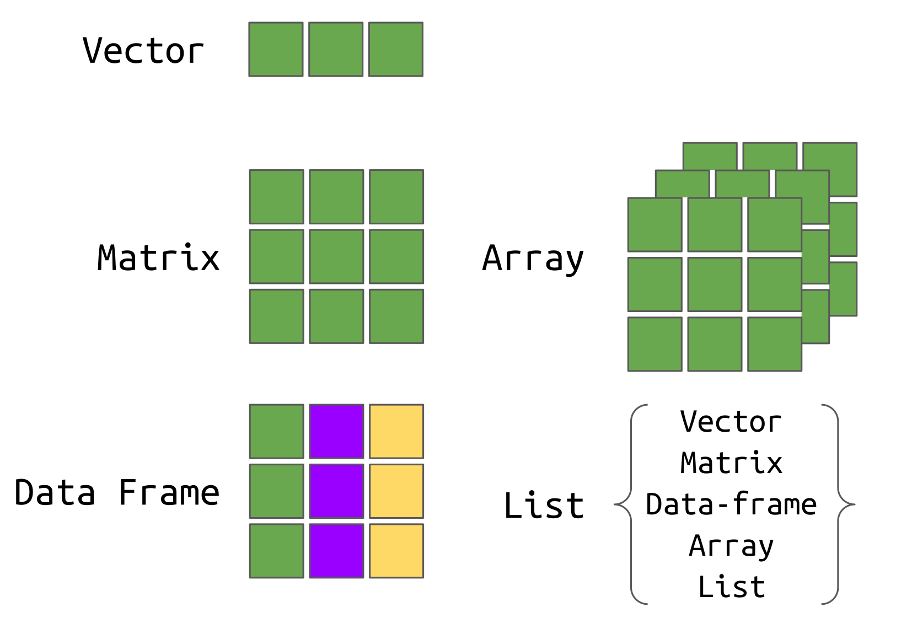

exclude: true
count: false

```{r,echo=FALSE,child="assets/header-slide.Rmd"}
```

<!-- ------------ Only edit title, subtitle & author above this ------------ -->

```{r,echo=FALSE,message=FALSE,warning=FALSE}
# load the packages you need
#library(dplyr)
#library(tidyr)
#library(stringr)
#library(ggplot2)
```

---
name: contents

## Contents of the lecture

- **vectors**
- **numbers as vectors**
- **strings as vectors**


---
name: cplx_data_str
exclude: true

## Complex data structures

Using the basic data types (`numeric`, `logical` and `character`) we can build more complex data structures:

<br>
<br>
-- 

.pull-left-50[

]

.pull-right-50[

dimensions | Homogenous | Heterogenous
----|------------|-----------------
0  | n/a        | n/a
1  | vectors    | list
2  | matrices   | data frame
n  | arrays     | n/a  


]
---
name: atomic_vectors

## Vectors
A *vector*, or *atomic vector*, is a sequence of elements of the same data type.

We build vectors using the function `c()` (combine).
```{r vector, echo=T} 
vec <- c(1, 2, 3)
vec
```
In R, even a single number is a one-element vector. Get used to think in terms of vectors...

---
name: atomic_vectors2

## Vectors cted.
You can also create empty/zero vectors of a given type and length:
```{r vec.empty, echo=T}
vector('integer', 5) # a vector of 5 integers
vector('character', 5)
character(5) # does the same
logical(5) # same as vector('logical', 5)
```

---
name: combining_vectors

## Combining two or more vectors
Vectors can easily be combined:
```{r vec.comb, echo=T}
v1 <- c(1,2,3)
v2 <- c('a','b','c')
v3 <- c('do','re','mi')
c(v1, v2, v3)
```
Note that after combining numbers with characters, all elements became character. 

This is called a **coercion**.

---
name: basic_vect_arithm

## Basic vector arithmetics
We can perform operations on **numeric** vectors:
```{r vec.artihmetics, echo=T}
v1 <- c(1, 2, 3, 4)
v2 <- c(7, -9, 15.2, 4)
v1 + v2 # addition
```

--

```{r}
v1 - v2 # subtraction
```

--

```{r}
v1 * v2 # multiplication
```

--

```{r}
v1 / v2 # division
```

---
name: recycling_rule

## Vectors &ndash; recycling rule
```{r vec.recycling, echo=T}
v1 <- c(1, 2, 3, 4, 5)
v2 <- c(0, 1)
v1 + v2
```
Values in the shorter vector will be **recycled** (repeated) to match the length of the longer one.

In this case, `v2 <- c(0, 1)` becomes `v2 <- c(0, 1, 0, 1, 0)` so that it can be added to v1.

---
name: vec_indexing

## Vectors &ndash; indexing
We can access or retrieve particular elements of a vector by using the [] notation:
```{r vec.indexing, echo=T}
vec <- c('a', 'b', 'c', 'd', 'e')
vec[1] # the first element
vec[5] # the fifth element
vec[-1] # remove the first element
```

---
name: vec_indexing2

## Vectors &ndash; indexing cted.
And what happens if we want to retrieve elements outside the vector?
```{r vec.index.beyond, echo=T}
vec <- c('a', 'b', 'c', 'd', 'e')
vec[0] # R counts elements from 1
vec[10] # Positive index past the length of the vector
vec[-6] # Negative index past the length of the vector
```

--

An index of **zero** will result in an empty vector of the same type as the original vector.

A **positive** index beyond the vector's length will result in an `NA` value.

A **negative** index beyond the vector's length will result in the full unchanged vector. Basically, R ignores your request.

---
name: vec_indexing3

## Vectors &ndash; indexing cted.
You can also retrieve elements of a vector using a vector of indices:
```{r vec.index.vec, echo=T}
vec <- c('a', 'b', 'c', 'd', 'e')
vec.ind <- c(1,3,5)
vec[vec.ind]
```

--

Or even a logical vector:
```{r vec.index.vec.log, echo=T}
vec <- c('a', 'b', 'c', 'd', 'e')
vec.ind <- c(TRUE, FALSE, TRUE, FALSE, TRUE)
vec[vec.ind]
```

---
name: vec_indexing_names

## Vectors &ndash; indexing using names
You can name elements of your vector:
```{r vec.index.names, echo=T}
vec <- c(23.7, 54.5, 22.7)
names(vec) # by default there are no names
names(vec) <- c('sample1', 'sample2', 'sample3')
vec
vec[c('sample2', 'sample1')]
```

---
name: vec_rem_elem

## Vectors &ndash; removing elements
You can return a vector without certain elements:
```{r vec.rm, echo=T}
vec <- c(1, 2, 3, 4, 5)
vec[-5] # without the 5-th element
vec[-(c(1,3,5))] # without elements 1, 3, 5
```

---
name: vec_conditions

## Vectors indexing &ndash; conditions
Also logical expressions are allowed in indexing:
```{r vec.index.cond, echo=T}
vec <- c(1, 2, 3, 4, 5)
vec < 3 # we can use the value of this logical comparison
vec[vec < 3]# Et voila!
```

---
name: vec_more_ops

## Vectors &ndash; more operations
You can easily reverse a vector:
```{r vec.rev, echo=T}
vec <- c(1, 2, 3, 4, 5)
rev(vec)
```

--

You can generate vectors of subsequent numbers using `:`, e.g.:
```{r vec.seq.gen, echo=T}
v <- c(5:7)
v
v2 <- c(3:-4)
v2
```

---
name: vec_size

## Vectors &ndash; size
To get the size of a vector, use `length()`:
```{r vec.len, echo=T}
vec <- c(1:78)
length(vec)
```

---
name: vec_subst_elem

## Vectors &ndash; substitute element
To substitute an element in a vector simply:
```{r vec.subst, echo=T}
vec <- c(1:5)
vec
vec[3] <- 'a' # Note the coercion!
vec 
```

--

To insert 'a' at the 2nd position:
```{r vec.ins, echo=T}
vec <- c(1:5)
vec
c(vec[1], 'a', vec[2:length(vec)])
```

---
name: vec_alter_len

## Vectors &ndash; changing the length
What if we write past the vectors last element?
```{r vec.chlen, echo=T}
vec <- c(1:5)
vec
vec[9] <- 9
vec 
```

---
name: vec_count_vals

## Vectors &ndash; counting values
One may be interested in the count of particular values:
```{r vec.table, echo=T}
vec <- c(1:5, 1:4, 1:3) # a vector with repeating values
table(vec) # table of counts
tab <- table(vec)/length(vec) # table of freqs.
round(tab, digits=3) # and let's round it
```

---
name: vec_sorting

## Vectors &ndash; sorting
To sort values of a vector:
```{r vec.sort, echo=T}
vec <- c(1:5, NA, NA, 1:3)
sort(vec) # oops, NAs got lost
sort(vec, na.last = TRUE)
sort(vec, decreasing = TRUE) # in a decreasing order
```

---
name: seq

## Sequences of numbers
R provides also a few handy functions to generate sequences of numbers:
```{r seq, echo=T}
seq(from=1, to=10, by=2)
seq(from=21, to=23, by=0.25)
seq(from=10, to=1, by=-2)
```

---
exclude: true
name: printing_brackets

## A detour &ndash; printing with `()`
Note what we did here, if you enclose the expression in `()`, the result of assignment will be also printed:

```{r assignprint, echo=T}
seq1 <- seq(from = 1, to = 5)
seq1 # has to be printed explicitly
```
while:

```{r assignprint2, echo=T}
(seq2 <- seq(from = 5, to = 1)) # will print automatically
```

---
name: seq2

## Repeating sequences
One may also wish to repeat a value or a vector n times:
```{r rep, echo=T}
rep('a', times=5)
rep(1:5, times=3)
rep(seq(from=1, to=3, by=2), times=2)
```

---
name: paste

## Pasting things together
We can **concatenate** character vectors together using `paste()`
```{r concat, echo=T}
firstname <- c('Pedro','Maria','Ana')
lastname <- c('Silva','Andersson','Smith')
paste(firstname, lastname, sep = ' ')
```
--
Optionally, we can provide the collapse argument:
```{r concat2, echo=T}
paste(firstname, lastname, sep = ' ', collapse = '; ')
```

---
name: random_seq

## Sequences of random numbers
We can use `sample()` to generate sequences of random numbers:

```{r sample, echo=T}
# simulate casting a fair dice 10x
sample(x = c(1:6), size=10, replace = T) 
# make it unfair, it is loaded on '3'
myprobs = rep(0.15, times = 6)
myprobs[3] <- 0.25 # a bit higher probability for '3'
sample(x = c(1:6), size = 10, replace = T, prob=myprobs)
```

---
name: simulate_dice

## Fair vs. loaded dice
Now, let us see how this can be useful. We need more than 10 results. Let's cast our dices 10,000 times and plot the freq. distribution.
```{r dices, echo=T}
# simulate casting a fair dice 10x
fair <- sample(x = c(1:6), size=100000, replace = T) 
unfair <- sample(x = c(1:6), size=100000, replace = T, prob = myprobs)

# calculate frequency
t1 <- table(fair)/length(fair)
t2 <- table(unfair)/length(unfair)
dice_matrix <- rbind(t1, t2)
rownames(dice_matrix) <- c("Fair", "Unfair")
```

---
name: simulate_dice2

## Fair vs. loaded dice &ndash; the result
```{r dices.pic, fig=T, fig.height=4, echo=F,eval=F}
t1 <- table(fair)/length(fair)
t2 <- table(unfair)/length(unfair)
plot(0,0,type="b",xlim=c(1,6.0),ylim=c(0,.3),xlab="x",ylab="freq",bty='n', las=1)
grid()
points(1:6, t1, col="olivedrab", pch = 19)
points(1:6, t2, col="slateblue", pch = 19)
legend('topleft', legend = c('fair','unfair'), col = c('olivedrab', 'slateblue'), pch = 19, border = NULL, bty='n')
```

```{r dicex, echo=T, fig.width=9, fig.height=5}
barplot(
  height = dice_matrix, beside = TRUE,
  xlab = "Dice Face Value", ylab = "Relative Frequency",
  col = c("olivedrab", "slateblue"),
  legend.text = rownames(dice_matrix),
  args.legend = list(x = "topright", bty = 'n'),
  ylim = c(0, 0.30)
)
```

---
name: more_on_sample

## Sample &ndash; one more use
The sample function has one more interesting feature, it can be used to randomize order of already created vectors:
```{r sample.shuffle, echo=T}
mychars <- c('a', 'b', 'c', 'd', 'e', 'f')
mychars
sample(mychars)
sample(mychars)
```

---
name: vec_adv

## Vectors/sequences &ndash; more advanced operations
```{r vec.adv.oper, echo=T}
v1 <- sample(1:5, size = 4)
v1
max(v1) # max value of the vector
min(v1) # min value
sum(v1) # sum all the elements
mean(v1) # mean of all elements
```

---
exclude: true
name: vec_adv2

## Vectors/sequences &ndash; more advanced operations 2
```{r vec.adv.oper2, echo=T}
v1
diff(v1) # diff. of element pairs
cumsum(v1) # cumulative sum
prod(v1) # product of all elements
```

---
name: vec_adv3
exclude: true

## Vectors/sequences &ndash; more advanced operations 3
```{r vec.adv.oper3, echo=T}
v1
cumprod(v1) # cumulative product
cummin(v1) # minimum so far (up to i-th el.)
cummax(v1) # maximum up to i-th element
```

---
exclude: true
name: vec_pairwise_comp

## Vectors/sequences &ndash; pairwise comparisons
```{r make.vec2}
v2 <- sample(1:5, size=4)
```
```{r vec.adv.pairwise, echo=T}
v1
v2
v1 <= v2 # direct comparison
pmin(v1, v2) # pairwise min
pmax(v1, v2) # pairwise max
```

---
name: vec_order_rank

## Vectors/sequences &ndash; ordering
Ordering can be dealt with in many ways.
```{r vec.adv.rank.order, echo=T}
v1 <- c(1, 3, 4, 5, 3, 2)
rank(v1) # show rank of each value (min has rank 1)
order(v1) # order of indices for a sorted vector
v1[order(v1)]
sort(v1)
```

---
name: factors

## Factors
To work with **nominal** values, R offers a special data type, a *factor*:
```{r factor, echo=T}
vec <- c('blue', 'yellow', 'purple', 
         'yellow', 'yellow', 'blue')
vec.f <- factor(vec)
summary(vec.f)
```
The levels of a factor are coded alphabetically by default. So blue is coded as 1, purple as 2 and yellow as 3.

Factors are really just a special type of integer vectors.
```{r factor2, echo=T}
as.numeric(vec.f)
```

---
name: factors2

## Factors
You can manually control the coding/mapping of factors and their labels:
```{r factor.coding, echo=T}
vec <- c('blue', 'yellow', 'purple', 
         'yellow', 'yellow', 'blue')
vec.f <- factor(vec, levels=c('blue', 'purple', 'yellow', 'white'), 
                labels=c('sea','flower','sun','snow'))
summary(vec.f)
```


---
name: ordered_fac

## Ordered
To work with ordinal scale (ordered) variables, one can also use factors:
```{r ordinal, echo=T}
vec <- c('small', 'tiny', 'large', 'medium')
factor(vec) # rearranged alphabetically
```
--
We can control the order:
```{r ordinal2, echo=T}
factor(vec, levels = c('tiny', 'small', 'medium', 'large'),
       ordered=TRUE) # ordered as provided in the levels argument
```

---
name: recap_single_slide

### 🧱 Core Concepts & Types

| Concept | Description | Example |
| :--- | :--- | :--- |
| **Atomic Vector** | The fundamental 1D structure. **All elements must be the same type.** | `v <- c(10, 20)` |
| **Types** | `numeric`, `integer`, `character`, `logical`. (A single number is a vector.) | `c(TRUE, FALSE)` |
| **Coercion** | R converts elements to the **most flexible type** when mixing them. | `c(1, 'a')` $\to$ `"1"`, `"a"` (Character) |
| **Factors** | For **categorical data** (nominal/ordinal). Stored as integers with levels. | `factor(c('low', 'high'))` |

### ⚙️ Operations, Indexing, and Sequences

| Action/Function | Syntax | Purpose & Notes |
| :--- | :--- | :--- |
| **Access/Exclude** | `v[2]`, `v[-2]` | 1-indexed. Use `v[c(1, 3)]` for multiple elements. |
| **Logical Indexing** | `v[v > 5]` | Selects elements where the condition is TRUE. |
| **Arithmetic** | `v1 * v2` | **Element-wise** operations. |
| **Recycling** | Implicit | Shorter vector repeats to match the length of the longer one. |
| **Length** | `length(v)` | Returns the number of elements. |
| **Sorting** | `sort(v)`, `rev(v)` | Sorts values / reverses the order. |
| **Frequency** | `table(v)` | Counts the occurrences of unique values. |
| **Sequences** | `1:5`, `seq(1, 10, by=2)`, `rep('a', 3)` | Colon operator, sequential generation, and repetition. |

<!-- --------------------- Do not edit this and below --------------------- -->

---
name: end_slide
class: end-slide, middle
count: false

# We will talk about matrices in the next lecture!

```{r,echo=FALSE,child="assets/footer-slide.Rmd"}
```

```{r,include=FALSE,eval=FALSE}
# manually run this to render this document to HTML
rmarkdown::render("presentation_demo.Rmd")
# manually run this to convert HTML to PDF
#pagedown::chrome_print("presentation_demo.html",output="presentation_demo.pdf")
```


