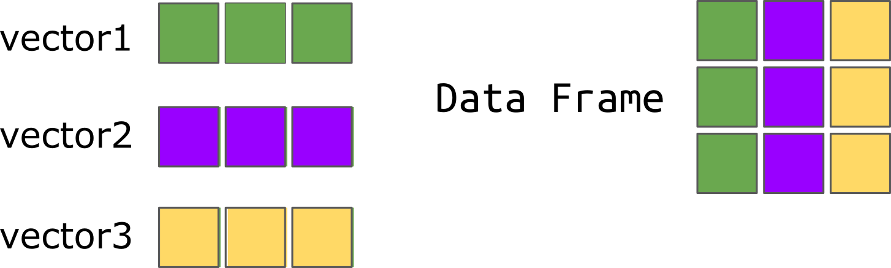

exclude: true
count: false

```{r,echo=FALSE,child="assets/header-slide.Rmd"}
```


```{r setup, include=FALSE}
knitr::opts_chunk$set(echo = FALSE)
```

---
name: contents

# Contents of the lecture

- **matrices**
- **data frames**
- **lists**

---
name: matrices

# Matrices

A **matrix** has 2 dimensions: rows and columns.
Like vectors, elements must be of the same type.

Say, we want to build this matrix in R:
$$\mathbf{X} = \left[\begin{array}
{rrr}
1 & 2 & 3 \\
4 & 5 & 6 \\
7 & 8 & 9
\end{array}\right]$$
```{r matrix, echo=T}
X <- matrix(1:9,
       nrow=3, 
       ncol=3,
       byrow=T)
X
```

---
name: matrices_dim

# Matrices &mdash; dimensions

To check the dimensions of a matrix, use `dim()`:
```{r matrix.dim, echo=T}
dim(X) # 3 rows and 3 columns
```


---
name: matrices_indexing

# Matrices &mdash; indexing

Elements of a matrix are retrieved using the `[]` notation.
We have to specify 2 dimensions -- the rows and the columns:

$$\mathbf{X} = \left[\begin{array}
{rrr}
1 & 2 & 3 \\
4 & 5 & 6 \\
7 & 8 & 9
\end{array}\right]$$

```{r matrix.ind, echo=T}
X[1,2] # 1st row, 2nd column
X[3,] # entire 3rd row
X[,2] # entire 2nd column
```

---
name: matrices_indexing_2
exclude: true

# Matrices &mdash; indexing cted.

$$\mathbf{X} = \left[\begin{array}
{rrr}
1 & 2 & 3 \\
4 & 5 & 6 \\
7 & 8 & 9
\end{array}\right]$$

```{r matrix.ind2, echo=T}
X[c(1,3),] # Retrieve rows 1 and 3
X[c(1,3),c(3,1)]
```

---
name: matrices_oper_1

# Matrices &mdash; operations

To order a matrix using the 2nd column:
```{r matrix.oper2, echo=T}
X <- matrix(sample(1:9,size = 9), nrow = 3)
X
ord <- order(X[,2])
X[ord,]
```

---
name: matrices_t

# Matrices &mdash; transposition

To **transpose** a matrix use `t()`:

```{r, echo=F}
X <- matrix(c(10, 20, 30, 40, 50, 60), 
  nrow = 2, 
  ncol = 3, 
  byrow = TRUE)
```
```{r matrix.t, echo=T}
X
t(X)
```


---
name: matrices_oper_2
exclude: true

# Matrices &mdash; operations 2

To get the diagonal of the matrix:
```{r matrix.diag, echo=T}
X
diag(X) # get values on the diagonal
```

---
name: matrices_tri
exclude: true

# Matrices &mdash; operations, triangles

To get the upper or the lower triangle use `upper.tri()` and `lower.tri()` respectively:

```{r matrix.tri, eval=F, echo=T}
X # print X
upper.tri(X) # which elements form the upper triangle
X[upper.tri(X)] <- 0 # set them to 0
X # print the new matrix
```

---
name: matrices_multi

# Matrices &mdash; multiplication

Different types of matrix multiplication exist:
```{r matrix.multi, echo=T}
A <- matrix(1:4, nrow = 2, byrow=T)
B <- matrix(5:8, nrow = 2, byrow=T)
A * B # Hadamard product
```
--
```{r matrix.multi2, echo=T, eval=F}
A %*% B # Matrix multiplication
A %x% B # Kronecker product
A %o% B # Outer product (tensor product)
```

---
name: matrices_outer

# Matrices &mdash; outer

Outer product can be useful for generating combinations
```{r matrix.outer1, echo=T}
outer(letters[1:4], LETTERS[1:4], paste, sep="-")
```

---
name: matrices_expand_grid
exclude: true

# Expand grid

But `expand.grid()` is more convenient when you want, e.g. generate combinations of variable values:
```{r matrix.expand.grid, echo=T}
expand.grid(height = seq(120, 121),
            weight = c('1-50', '51+'),
            sex = c("Male","Female"))
```

---
name: matrices_apply

# Matrices &mdash; apply

If we want to have mean of each column:

```{r matrix.apply, echo=T}
X
apply(X, MARGIN=2, mean) # 1 = rows, 2 = columns
```

--
And we can use any function
```{r, echo=T}
myfunction <- function(x){
  sum(x) + mean(x) + sqrt(sum(x))
}
apply(X, MARGIN=2, myfunction)
```
---
name: matrices_apply_2
exclude: true

# Matrices &mdash; apply cted.

And now we will use `apply()` to calculate for each element in a matrix its deviation from the mean squared:

```{r matrix.apply2, echo=T}
X
my.mean <- mean(X)
apply(X, MARGIN=c(1,2),
      function(x, my.mean) (x - my.mean)^2, my.mean)
```

---
name: matrices_colSums

# Matrices &mdash; useful fns.

There are pre-made functions for common operations:

```{r matrix.colSums, echo=T}
X
# instead of apply(X, MARGIN=2, mean)
colMeans(X)
```
These functions are faster!

---
name: matrices_add_row_col

# Matrices &mdash; inserting rows/columns

To add rows or columns to a matrix; or to make a matrix out of two or more vectors of equal length:

```{r matrix.binding, echo=T}
x <- c(1,1,1)
y <- c(2,2,2)
cbind(x,y)
rbind(x,y)
```

---
name: matrices_arrays
exclude: true

# Matrices &mdash; more dimensions

```{r matrix.multidim, echo=T}
dim(Titanic)
```

--
exclude: true

```{r matrix.Titanic.plot, echo=F, message=F, fig.width = 6, fig.height = 3.5, dpi=120}
library(vcd)
mosaic(Titanic, gp_labels=gpar(fontsize=7))
```

---
name: data_frames_1

# Data frames  

- **Data frames** are also two-dimensional data structures.
- Different columns can have different data types!
- Technically, a data frame is just a list of vectors.

--
<br/><br/>

<center>
.size-70[

]
</center>

---
name: data_frames_create

# Data frames &mdash; creating a data frame

```{r data.frame.create, echo=T}
dfr <- data.frame(c(1:5),
                 LETTERS[1:5],
                 c(T,F,F,T,T))
dfr
```


---
name: data_frames_columns

# Data frames &mdash; name your columns!

- Always try to give meaningful names to your columns

```{r data.frame.name, echo=T}
dfr <- data.frame(numbers=c(1:5),
                 letters=LETTERS[1:5],
                 logical=c(T,F,F,T,T))
dfr
```

---
name: data_frames_accessing

# Data frames &mdash; accessing values

- We can always use the `[row,column]` notation to access values inside data frames.

```{r data.frame.access, echo=T}
dfr[1,]  # get the first row
dfr[,2]  # the second column
dfr[2:3, 'letters'] # get rows 2-3 from the 'letters' column
```

---
name: data_frames_dollar

# Data frames &mdash; accessing values

- We can also use dollar sign `$` to access columns

```{r data.frame.dollar, echo=T}
dfr$letters # get the column named 'letters'
dfr$letters[2:3] # get the second and third elements of the column named 'letters'
```


---
name: data_frames_factors_1
exclude: true

# Data frames &mdash; factors

An interesting observation:

```{r data.frame.factor, echo=T, eval=F}
dfr$letter
dfr$letter <- as.character(dfr$letter)
dfr$letter
```
---
name: data_frames_factors_2
exclude: true

# Data frames &mdash; factors cted.

To treat characters as characters at data frame creation time, one can use the **stringsAsFactors** option set to TRUE:

```{r data.frame.factor2, echo=T, eval=F}
dfr <- data.frame(no=c(1:5),
                 letter=c("a","b","c","d","e"),
                 isBrown=sample(c(TRUE, FALSE),
                        size = 5,
                        replace=T),
                 stringsAsFactors = TRUE)
dfr$letter
```
Well, as you see, it did not work as expected...

---
name: data_frames_names

# Data frames &mdash; names

To get or change row/column names:

```{r data.frame.names, echo=T}
colnames(dfr) # get column names
colnames(dfr) <- c('num','let','logi') # assign column names
colnames(dfr)
rownames(dfr) # get row names
rownames(dfr) <- letters[1:5] # assign row names
rownames(dfr)
```

---
name: data_frames_merging

# Data frames &mdash; merging

We can merge two data frames on certain a key using  `merge()`:

```{r data.frame.merge, echo=T}
age <- data.frame(ID=c(1:4),
                  age=c(37,48,22,NA))
clinical <- data.frame(ID=c(1:4),
                       status=c("sick","healthy","healthy","sick"))
patients <- merge(age, clinical, by='ID')
patients
```

---
name: data_frames_summarizing

# Data frames &mdash; summarising

To get an overview of the data in each column, use `summary()`:

```{r data.frame.summary, echo=T}
summary(patients)
```

---
name: data_frames_missing

# Data frames &mdash; missing data

We can use functions to deal with missing values:

```{r data.frame.missing, echo=T}
is.na(patients) # check where the NAs are
```
--
```{r data.frame.missing2, echo=T}
na.omit(patients) # remove all rows containing NAs
```
--
```{r data.frame.missing3, echo=T}
patients[rowSums(is.na(patients)) > 0,] # select rows containing NAs
```


---
name: lists_1

# Lists  &mdash; collections of various data types

A **list** is a special type of vector. It can hold any data type. 

```{r lists, echo=T}
bedr <- data.frame(product = c("POANG", "MALM", "RENS"),
                      type = c("chair", "bed", "rug"),
                      price = c(1200, 2300, 899))
rest <- data.frame(dish = c("kottbullar", "daimtarta"),
                         price = c(89, 32))
park <- 162
opn <- FALSE
```
--
```{r lists2, echo=T}
ikea_uppsala <- list(bedroom = bedr, 
             restaurant = rest, 
             parking = park,
             open = opn)
```
--
```{r lists3, echo=T}
str(ikea_uppsala) # str (structure) of an object
```

---
name: lists_subsetting_double

# Subsetting lists

We can access elements of a list using the `[[]]` notation. 

```{r lists_subsetting_double, echo=T}
ikea_uppsala[[2]]
class(ikea_uppsala[[2]])
```

---
name: lists_subsetting_single

# Subsetting lists &mdash; .cted

What if we use `[]`? We get a list back!

```{r lists_subsetting_single, echo=T}
ikea_uppsala[2]
class(ikea_uppsala[2])
```

---
# Subsetting lists &mdash; .cted

- A piece of a list is still a list! Use `[[]]` to pull out the actual data.


---
name: lists_subsetting_names

# Subsetting lists &mdash; using names

If the elements of a list are named, we can also use the `$` notation:

```{r lists_subsetting_names, echo=T}
ikea_uppsala$restaurant
ikea_uppsala$restaurant$price
```

---
name: lists_nested

# Lists inside lists

We can use lists to store hierarchies of data:

```{r lists_nested, echo=T}
ikea_lund <- list(parking = 125)
ikea_sweden <- list(ikea_lund = ikea_lund, 
                    ikea_uppsala = ikea_uppsala)
# use names to navigate inside the hierarchy
ikea_sweden$ikea_lund$parking
ikea_sweden$ikea_uppsala$parking
```


---
name: objects_type_class
exclude: true

# Objects &mdash; type vs. class

An object of class **factor** is internally represented by numbers:

```{r obj.type.class, echo=T, eval=F}
size <- factor('small')
class(size) # Class 'factor'
mode(size) # Is represented by 'numeric'
typeof(size) # Of integer type
```

---
name: objects_str
exclude: true

# Objects &mdash; structure

Many functions return **objects**. We can easily examine their **structure**:

```{r obj.str, echo=T, fig.height=3.7, fig.width=3}
his <- hist(1:5, plot=F)
str(his)
object.size(hist) # How much memory the object consumes
```

---
name: objects_fix
exclude: true

# Objects &mdash; fix

We can easily modify values of object's **attributes**:

```{r obj.fix, echo=T, eval=F}
attributes(his)
attr(his, "names")
#fix(his) # Opens an object editor
```

---
name: objects_lists_as_S3
exclude: true

# Lists as S3 classes

A list that has been named, becomes an S3 class:
```{r obj.S3.list, echo=T, eval=F}
my.list <- list(numbers = c(1:5),
                letters = letters[1:5])
class(my.list)
class(my.list) <- 'my.list.class'
class(my.list) # Now the list is of S3 class
```

However, that was it. We cannot enforce that *numbers* will contain numeric values and that *letters* will contain only characters. S3 is a very primitive class.

---
name: objects_S3
exclude: true

# S3 classes

For an S3 class we can define a *generic function* applicable to all objects of this class.
```{r obj.S3, echo=T, eval=F}
print.my.list.class <- function(x) {
  cat('Numbers:', x$numbers, '\n')
  cat('Letters:', x$letters)
}
print(my.list)
```

But here, we have no error-proofing. If the object will lack *numbers*, the function will still be called:

```{r obj.S3.error, echo=T, eval=F}
class(his) <- 'my.list.class' # alter class
print(his) # Gibberish but no error...
```

---
name: objects_generics
exclude: true

# S3 classes &mdash; still useful?

Well, S3 class mechanism is still in use, esp. when writing **generic** functions, most common examples being *print* and *plot*. For example, if you plot an object of a Manhattan.plot class, you write *plot(gwas.result)* but the true call is: *plot.manhattan(gwas.result)*. This makes life easier as it requires less writing, but it is up to the function developers to make sure everything works!

---
name: objects_S4
exclude: true

# S4 class mechanism

S4 classes are more advanced as you actually define the structure of the data within the object of your particular class:
```{r S4, echo=T, eval=F}
setClass('gene',
         representation(name='character',
                        coords='numeric')
         )
my.gene <- new('gene', name='ANK3',
               coords=c(1.4e6, 1.412e6))
```

---
name: objects_S4_slots
exclude: true

# S4 class &mdash; slots

The variables within an S4 class are stored in the so-called **slots**. In the above example, we have 2 such slots: *name* and *coords*. Here is how to access them:

```{r S4.slots, echo=T, eval=F}
my.gene@name # access using @ operator
my.gene@coords[2] # access the 2nd element in slot coords
```

---
name: objects_S4_methods
exclude: true

# S4 class &mdash; methods

The power of classes lies in the fact that they define both the data types in particular slots and operations (functions) we can perform on them. Let us define a *generic print function* for an S4 class:

```{r S4.methods, echo=T, eval=F}
setMethod('print', 'gene',
          function(x) {
              cat('GENE: ', x@name, ' --> ')
              cat('[', x@coords, ']')
          })
print(my.gene) # and we use the newly defined print
```

<!-- --------------------- Do not edit this and below --------------------- -->

---
name: end_slide
class: end-slide, middle
count: false

# See you at the next lecture!

```{r, echo=FALSE,child="assets/footer-slide.Rmd"}
```

```{r,include=FALSE,eval=FALSE}
# manually run this to render this document to HTML
#rmarkdown::render("presentation_demo.Rmd")
# manually run this to convert HTML to PDF
#pagedown::chrome_print("presentation_demo.html",output="presentation_demo.pdf")
```
