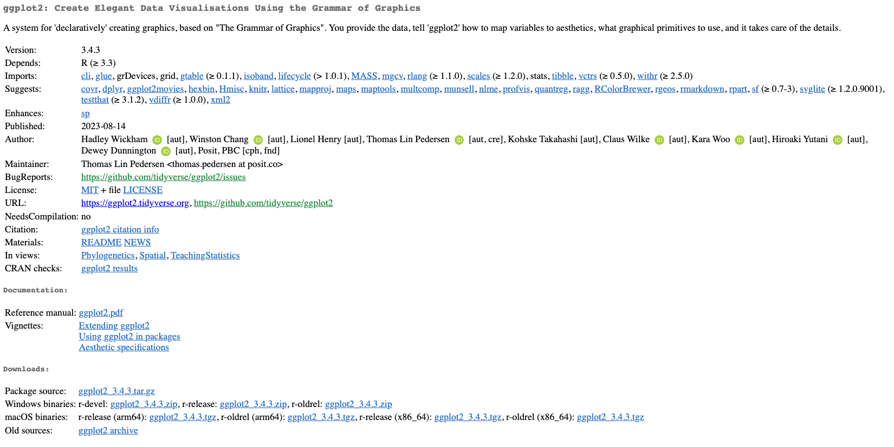

exclude: true
count: false

```{r,echo=FALSE,child="assets/header-slide.Rmd"}
```

<!-- ------------ Only edit title, subtitle & author above this ------------ -->

```{r setup, include=FALSE}
knitr::opts_chunk$set(echo = TRUE, width=60)
```

```{r,include=FALSE}
# load the packages you need
#library(dplyr)
#library(tidyr)
#library(stringr)
#library(ggplot2)
library(mkteachr)
```

---
name: working_with_r

# Working with R

There are several ways to work with/in R:

- from a command line,
- in batch mode,
- from a native GUI,
- using external editor, e.g. RStudio.

During this course, we will be focusing on working with [RStudio](https://www.rstudio.com) and also in *batch mode*.

---
name: cline_working

# Working from command line

1. Open Terminal.
2. Type `R`.
3. Type R commands...
4. Type `q()` to quit R.

- Arrows let you browse throughout the history (&uarr; & &darr;).
- .kbd[TAB] attempts to autocomplete the command you have just started typing.

---
name: batch_mode

# The batch mode

If you are working on a computational cluster, such as the Uppmax, it is very likely you would like to run large jobs that one has to enqueue. This makes interactive work from the console virtually impossible. The solution is to run R code from a file, using the so-called **batch mode**:

1. Create a file with your code and give it extension **.R**.
2. In the console (or in the queue script) write:  

`R --vanilla < mycode.R` [two minus signs in front of *vanilla*].

Should you like to log the output add either:

- `R --vanilla < mycode.R > output.log` or like this
- `R --vanilla < mycode.R | tee output.log`  

---
name: help

# Getting help

```{r help,echo=TRUE,eval=FALSE}
help(t.test) # function level
?t.test # same as above
??t.test # extensive search
vignette("car") # package level demo(graphics)
example(barplot) # run help examples for barplot
demo() # see all currently available demos
demo('graphics') # run demo for 'graphics'
```

[Stackoverflow](http://stackoverflow.com) is a great resource.  
And these days [ChatGPT](https://chat.openai.com/). 

---
name: work_with_packages

# Working with packages

Packages are organised in repositories. The three main repositories are:

* [CRAN](https://cran.r-project.org)
* [R-Forge](http://r-forge.r-project.org)
* [Bioconductor](http://www.bioconductor.org)

We also have [GitHub](https://github.com).

--
# Working with packages -- CRAN example.

```{r,out.width="100%",fig.align='center',echo=FALSE}

```

---
name: pkg_cran_inst

# Working with packages -- installation

Only a few packages are pre-installed:

```{r pkg.err.ex,eval=TRUE,error=TRUE}
library(XLConnect)
```

In order to install a package from command line, use:

```{r pkg.inst,eval=FALSE}
install.packages("ggplot2",dependencies=TRUE)
```

---
name: work_pkg_details

# Working with packages -- details

It may happen that you want to also specify the repository, e.g. because it is geographically closer to you or because your default mirror is down:

```{r pkg.inst.repo,eval=FALSE}
install.packages('ggplot2',dependencies=TRUE,repos="http://cran.se.r-project.org")
```

But, sometimes, this does not work either because the package is not available for your platform. In such case, you need to *compile* it from its *source code*.

---
name: work_pkg_details2

# Working with packages -- details cted.
```{r,out.width="150%",fig.align='center',echo=FALSE}

```

---
name: source_pkg_inst

# Working with packages -- installing from source.

- Make sure you have appropriate tools installed, e.g. XCode or build-essentials.
- Download the source file, in our example *GenABEL_1.8-0.tar.gz*.
- Install it:

```{r pkg.inst.src,eval=FALSE}
install.packages("path/to/ggplot2_3.4.3.tar.gz",
                 repos=NULL,
                 type='source',
                 dependencies=TRUE)
```

- Load it:

```{r pkg.load,eval=FALSE}
library('ggplot2') # always forces reloading
require('ggplot2') # load only if not already loaded
```

- Enjoy!

---
name: pkg_github

# Packages -- GitHub

Nowadays, more and more developers contribute their packages via GitHub. The easiest way to install packages from the GitHub is via the *devtools* package:

- Install the *devtools* package.
- Load it.
- Install.
- Enjoy!

```{r pkg.inst.devtools.github,eval=FALSE}
install.packages('devtools',dependencies=TRUE)
library('devtools')
install_github('talgalili/installr')
```

---
name: pkg_bioconductor

# Packages -- Bioconductor

```{r,out.width="200pt",fig.align='center',echo=FALSE}

```

First install Bioconductor Manager:

```{r inst.biocond,eval=FALSE}
if (!requireNamespace("BiocManager",quietly = TRUE))
    install.packages("BiocManager")
```

---
name: pkg_bioconductor2

# Packages -- Bioconductor cted.

Now, you can install particular packages from Bioconductor:

```{r biocond.inst.pkg,eval=FALSE}
BiocManager::install("GenomicRanges")
```

For more info, visit [Bioconductor website](http://www.bioconductor.org/install/).

---
# One package to rule them all -- the magic of `renv`

- first time do `renv::activate()` and `renv::init()`
- while working: `renv::hydrate()` and `renv::snapshot()`

Now, send `renv.lock` to your friend to share the environment and she can:

- restore the environment `renv::restore()`

**Pure magic!**

---
name: rstudio

# RStudio -- a live demonstration


<!-- --------------------- Do not edit this and below --------------------- -->

---
name: end_slide
class: end-slide, middle
count: false

# See you at the next lecture!

```{r, echo=FALSE,child="assets/footer-slide.Rmd"}
```

```{r,include=FALSE,eval=FALSE}
# manually run this to render this document to HTML
#rmarkdown::render("presentation_demo.Rmd")
# manually run this to convert HTML to PDF
#pagedown::chrome_print("presentation_demo.html",output="presentation_demo.pdf")
```
