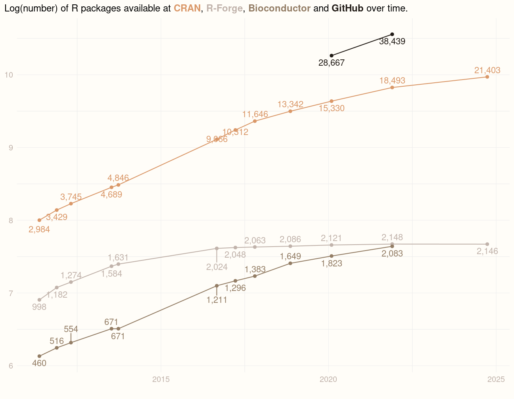

exclude: true
count: false

```{r,echo=FALSE,child="assets/header-slide.Rmd"}
```

<!-- ------------ Only edit title, subtitle & author above this ------------ -->

```{r,echo=FALSE,message=FALSE,warning=FALSE}
# load the packages you need
#library(dplyr)
#library(tidyr)
#library(stringr)
#library(ggplot2)
#library(mkteachr)
```

---
name: content
class: spaced

# Contents

* [Why R](#whyR)
* [About R](#about)
* [Pros and cons of R](#pros_and_cons)
* [Ecosystem of packages](#num_packages)
* [Programming language](#programming_language)
* [Packages](#packages)
* [Package installation](#pkg_cran_inst)

---
name: whyR

# WHY R?
.pull-left-50[


]

# With the power of R, your project can ARISE:  

--

 **A**utomative: Streamline your analysis

--

 **R**eproducible: Reproduce the results

--

 **I**nterpretable: Make sense  

--

 **S**hareable: Share with colleagues/mentors (FAIR)

--

 **E**xplainable: Easy to explain


---
name: about

# Briefly about R

.pull-left-50[

# R is ...

* a programming language
* a programming platform (= environment + interpreter)
* a software project driven by the core team and the community
* a very powerful tool for statistical computing
* a very powerful computational tool in general
* a catalyst between an idea and its realization  

]

--

.pull-right-50[

# R is not ...

* a tool to replace a statistician
* the very best programming language
* the most elegant programming solution
* the most efficient programming language  

]

--

.pull-left-70[

# Yet ...

* it is very elegant
* it becomes more and more feature-rich

]

.pull-right-30[

]

---
name: timeline

---
name: pros_and_cons
class: spaced

# Pros and cons

<i class='fa fa-minus-square'></i> steep learning curve  

--
<i class='fa fa-plus-square'></i> uniform, clear and clean system of documentation and help  

--
<i class='fa fa-minus-square'></i> difficulties due to a limited object-oriented programming capabilities,  
e.g. an agent-based simulation is a challenge  

--
<i class='fa fa-plus-square'></i> good interconnectivity with compiled languages like Java or C    

--
<i class='fa fa-minus-square'></i> cannot order a pizza for you (?)  

--
<i class='fa fa-plus-square'></i> a very powerful ecosystem of packages  

--
<i class='fa fa-plus-square'></i> free and open source, GNU GPL and GNU GPL 2.0  

--
<i class='fa fa-plus-square'></i> easy to generate high quality graphics  

---
name: programming_language

# Programing Language    

--
> Programming is a process of instructing a computer to perform a specific task. We write these instructions by **programming language**. It can be as simple as calculation (like a calculator) or complex applications. 

--

 * flow of _data_ 
--

    * Data is collected information which qualitatively and/or quantitatively describe an entity.  
--

    * Data is collected from quite diverse sources (data types).  
--

    * Data processing.  
--

    * Data cleaning.  

--

```{r,out.width="75%",fig.align='center',echo=FALSE}
knitr::include_graphics("data/slide_programming/Data_Information_Knowledge.png")
```
---
# Programing Language cted.   

--

 * from one _function_ to another
--

    * Function is a **reusable** chunk of code that performs a task. It takes **inputs** as well as **arguments** to process. 
--

 * each function does something to the data and return output(s)
--
   
   * For example `mean()`, `min()`   
--
---
# Three things to think about

 * what *types* of data can I process?

--

 * how do I *write* what I want?

--

 * when does it *mean* anything?


---
# Data type  

```{r,out.width="75%",fig.align='center',echo=FALSE}
knitr::include_graphics("data/slide_programming/Data_classification.png")
```
---

# Three components of a language

--

 * what *types* of data can I process &mdash; *type system*

--

  * int &mdash; 1 2 5 9
  * double &mdash; 1.23 -5.74
  * char &mdash; a b test 7 9
  * logical &mdash; TRUE/FALSE (T/F)
  

--

 * how do I *write* what I want &mdash; *syntax* defined by a language *grammar*

  `2 * 1 + 1` vs. `(+ (* 2 1) 1)`

--

 * when does it *mean* anything &mdash; *semantics*

--

  * *Colorful yellow train sleeps on a crazy wave.* &mdash; has no generally accepted meaning
  * *There is $500 on his empty bank acount.* &mdash; internal contradiction

---
name: topic2

# Where to start?


*Divide et impera* &mdash; divide and rule.

**Top-down approach:** define the big problem and split it into smaller ones. Assume you have solution to the small problems and continue &mdash; push the responsibility down.
Wishful thinking!

---

name: packages

# Packages

.pull-right-50[
```{r, out.width="250pt", fig.align='center', echo=FALSE}
knitr::include_graphics("data/slide_intro/packages.jpg")
```
]

--

* developed by the community

--

* cover several very diverse areas of science/life

--

* uniformly structured and documented

--

* organised in repositiries:
    + [CRAN](https://cran.r-project.org)
    + [R-Forge](https://r-forge.r-project.org)
    + [Bioconductor](http://www.bioconductor.org)
    + [GitHub](https://github.com)

---
name: num_packages
# Ecosystem of R packages
<br>


```{r num_pkgs, eval=FALSE, fig.align='center', fig.height=7, fig.width=9, message=FALSE, cache=TRUE, include=FALSE}
#I mute this chunk because it gives a readLines error in the 2024 course
#I add the figure instead below the chunk
#Maybe modify in the future
data <- mkteachr::update_repos_data()
gg <- mkteachr::plot_repos_data(data)
gg
```

<div style="text-align: center;">
    
</div>


---
name: work_with_packages

# Working with packages

Packages are organised in repositories. The three main repositories are:

* [CRAN](https://cran.r-project.org)
* [R-Forge](http://r-forge.r-project.org)
* [Bioconductor](http://www.bioconductor.org)

We also have [GitHub](https://github.com).

--
# Working with packages -- CRAN example.

```{r,out.width="80%",fig.align='center',echo=FALSE}
knitr::include_graphics("data/slide_r_environment/ggplot2_CRAN.png")
```

---
name: pkg_cran_inst

# Working with packages -- installation

Only a few packages are pre-installed:

```{r pkg.err.ex,eval=TRUE,error=TRUE}
library(modelr)
```

In order to install a package from command line, use:

```{r pkg.inst,eval=FALSE}
install.packages("ggplot2",dependencies=TRUE)
```

---
name: work_pkg_details

# Working with packages -- details

It may happen that you want to also specify the repository, e.g. because it is geographically closer to you or because your default mirror is down:

```{r pkg.inst.repo,eval=FALSE}
install.packages('ggplot2',dependencies=TRUE,repos="http://cran.se.r-project.org")
```

But, sometimes, this does not work either because the package is not available for your platform. In such case, you need to *compile* it from its *source code*.

---
name: work_pkg_details2

# Working with packages -- details cted.
```{r,out.width="150%",fig.align='center',echo=FALSE}
knitr::include_graphics("data/slide_r_environment/ggplot2_CRAN.png")
```

---
name: source_pkg_inst

# Working with packages -- installing from source.

- Download the source file, in our example *ggplot2_3.4.3.tar.gz*.
- Install it:

```{r pkg.inst.src,eval=FALSE}
install.packages("path/to/ggplot2_3.4.3.tar.gz",
                 repos=NULL,
                 type='source',
                 dependencies=TRUE)
```

- Load it:

```{r pkg.load,eval=FALSE}
library('ggplot2') # always forces reloading
require('ggplot2') # load only if not already loaded
```

- Enjoy!

---
name: pkg_github

# Packages -- GitHub

Nowadays, more and more developers distribute their packages via GitHub. The easiest way to install packages from the GitHub is via the *devtools* package:

- Install the *devtools* package.
- Load it.
- Install.
- Enjoy!

```{r pkg.inst.devtools.github,eval=FALSE}
install.packages('devtools',dependencies=TRUE)
library('devtools')
install_github('talgalili/installr')
```

---
name: pkg_bioconductor

# Packages -- Bioconductor

```{r,out.width="200pt",fig.align='center',echo=FALSE}
knitr::include_graphics("data/slide_r_environment/logo_bioconductor.png")
```

First install Bioconductor Manager:

```{r inst.biocond,eval=FALSE}
if (!requireNamespace("BiocManager",quietly = TRUE))
    install.packages("BiocManager")
```

---
name: pkg_bioconductor2

# Packages -- Bioconductor cted.

Now, you can install particular packages from Bioconductor:

```{r biocond.inst.pkg,eval=FALSE}
BiocManager::install("GenomicRanges")
```

For more info, visit [Bioconductor website](http://www.bioconductor.org/install/).

---
# One package to rule them all -- the magic of `renv`

- first time do `renv::activate()` and `renv::init()`
- while working: `renv::hydrate()` and `renv::snapshot()`

Now, send `renv.lock` to your friend to share the environment and she can:

- restore the environment `renv::restore()`

**Pure magic!**

<!-- --------------------- Do not edit this and below --------------------- -->

---
name: end_slide
class: end-slide, middle
count: false

# Thank you! Questions?
```{r, echo=FALSE,child="assets/footer-slide.Rmd"}
```

```{r,include=FALSE,eval=FALSE}
# manually run this to render this document to HTML
#rmarkdown::render("presentation_demo.Rmd")
# manually run this to convert HTML to PDF
#pagedown::chrome_print("presentation_demo.html",output="presentation_demo.pdf")
```
