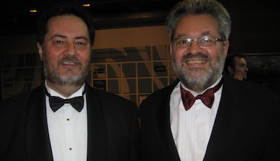
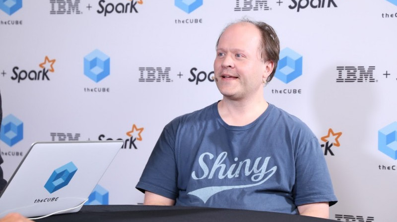

exclude: true
count: false

```{r,echo=FALSE,child="assets/header-slide.Rmd"}
```

<!-- ------------ Only edit title, subtitle & author above this ------------ -->

```{r,echo=FALSE,message=FALSE,warning=FALSE}
# load the packages you need
#library(dplyr)
#library(tidyr)
#library(stringr)
#library(ggplot2)
library(mkteachr)
```

---
name: content
class: spaced

# Contents

* [About R](#about)
* [Timeline](#timeline)
* [Ideas behind R](#ideas)
* [Pros and cons of R](#pros_and_cons)
* [Ecosystem of packages](#num_packages)

---
name: about

# Briefly about R

.pull-left-50[

# R is ...

* a programming language
* a programming platform (= environment + interpreter)
* a software project driven by the core team and the community
* a very powerful tool for statistical computing
* a very powerful computational tool in general
* a catalyst between an idea and its realization  

]

--

.pull-right-50[

# R is not ...

* a tool to replace a statistician
* the very best programming language
* the most elegant programming solution
* the most efficient programming language  

]

--

.pull-left-70[

# Yet ...

* it is very elegant
* it becomes more and more feature-rich

]

.pull-right-30[

]

---
name: timeline

# Timeline

--

.pull-left-50[



* ca. 1992 &mdash; conceived by [Robert Gentleman](https://bit.ly/35kn99L) and [Ross Ihaka](https://en.wikipedia.org/wiki/Ross_Ihaka) (R&R) at the University of Auckland, NZ as a tool for **teaching statistics**

* 1994 &mdash; initial version
* 2000 &mdash; stable version

]

--

.pull-right-50[



* 2011 &mdash; [RStudio](https://en.wikipedia.org/wiki/RStudio), first release by J.J. Allaire


* ca. 2017 &mdash; Tidyverse by [Hadley Wickham](https://en.wikipedia.org/wiki/Hadley_Wickham)
]

---
name: ideas

# Ideas behind R

* open-source solution &mdash; fast development

--

* based on the [S language](https://en.wikipedia.org/wiki/S_%28programming_language%29) created at the Bell Labs by [John Mc Kinley Chambers](https://bit.ly/2RhDqUx) to

> *turn ideas into software, quickly and faithfully*

--

* [lexical scope](https://en.wikipedia.org/wiki/Scope_%28computer_science%29%23Lexical_scoping) inspired by [Lisp](https://en.wikipedia.org/wiki/Lisp) syntax

--

* since 1997 developed by the R Development Core Team (ca. 20 experts, with Chambers onboard; 6 are active)

--

* overviewed by [The R Foundation for Statistical Computing](https://www.r-project.org/foundation/)

---
name: packages

# Packages

.pull-right-50[
```{r, out.width="250pt", fig.align='center', echo=FALSE}

```
]

--

* developed by the community

--

* cover several very diverse areas of science/life

--

* uniformely structured and documented

--

* organised in repositiries:
    + [CRAN](https://cran.r-project.org)
    + [R-Forge](https://r-forge.r-project.org)
    + [Bioconductor](http://www.bioconductor.org)
    + [GitHub](https://github.com)

---
name: pros_and_cons
class: spaced

# Pros and cons

<i class='fa fa-minus-square'></i> steep learning curve  

--
<i class='fa fa-plus-square'></i> uniform, clear and clean system of documentation and help  

--
<i class='fa fa-minus-square'></i> difficulties due to a limited object-oriented programming capabilities,  
e.g. an agent-based simulation is a challenge  

--
<i class='fa fa-plus-square'></i> good interconnectivity with compiled languages like Java or C    

--
<i class='fa fa-minus-square'></i> cannot order a pizza for you (?)  

--
<i class='fa fa-plus-square'></i> a very powerful ecosystem of packages  

--
<i class='fa fa-plus-square'></i> free and open source, GNU GPL and GNU GPL 2.0  

--
<i class='fa fa-plus-square'></i> easy to generate high quality graphics  

---
name: num_packages

# Ecosystem of R packages

<br>

```{r num_pkgs, echo=FALSE, fig.align='center', fig.height=7, fig.width=9, cache=TRUE, message=FALSE}
data <- mkteachr::update_repos_data()
gg <- mkteachr::plot_repos_data(data)
gg
```

<!-- --------------------- Do not edit this and below --------------------- -->

---
name: end_slide
class: end-slide, middle
count: false

# Thank you! Questions?

```{r,echo=FALSE,child="assets/footer-slide.Rmd"}
```

```{r,include=FALSE,eval=FALSE}
# manually run this to render this document to HTML
#rmarkdown::render("presentation_demo.Rmd")
# manually run this to convert HTML to PDF
#pagedown::chrome_print("presentation_demo.html",output="presentation_demo.pdf")
```
