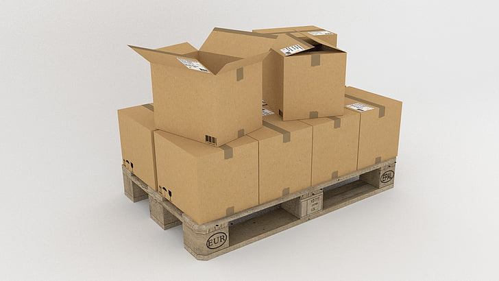

exclude: true
count: false

```{r,echo=FALSE,child="assets/header-slide.Rmd"}
```

```{r setup, include=FALSE}
# knitr::opts_chunk$set(echo = FALSE)
```

<!-- ------------ Only edit title, subtitle & author above this ------------ -->

```{r,echo=FALSE,message=FALSE,warning=FALSE}
# load the packages you need
#library(dplyr)
#library(tidyr)
#library(stringr)
#library(ggplot2)
#library(mkteachr)
```

---
name: content
class: spaced

# Contents

* [Why R](#whyR)
* [About R](#about)
* [Pros and cons of R](#pros_and_cons)
* [Ecosystem of packages](#num_packages)
* [Programming language](#programming_language)
* [Packages](#packages)
* [Package installation](#pkg_cran_inst)

---
name: whyR

# WHY R?
.pull-left-50[


]

# With the power of R, your project can ARISE:  

--

 **A**utomative: Streamline your analysis

--

 **R**eproducible: Reproduce the results

--

 **I**nterpretable: Make sense  

--

 **S**hareable: Share with colleagues/mentors (FAIR)

--

 **E**xplainable: Easy to explain


---
name: about

# Briefly about R

.pull-left-50[

# R is ...
.pull-right-30[

]

* a programming language
* a software project driven by the core team and the community
* a very powerful tool for statistical computing
* a very powerful computational tool in general
]

--


.pull-right-50[

# R is not ...

* a tool to replace a statistician
* the very best programming language
* the most elegant programming solution
* the most efficient programming language  

]


---
# Programing Language    

--
> Programming is a process of instructing a computer to perform a specific task. We write these instructions by **programming language**. It can be as simple as calculation (like a calculator) or complex applications. 

--

 * flow of _data_ 
--

    * Data is collected information which qualitatively and/or quantitatively describe an entity.  
--

    * Data is collected from quite diverse sources (data types).  
--

    * Data processing.  
--

    * Data cleaning.  

--

```{r,out.width="75%",fig.align='center',echo=FALSE}

```
---
# Programing Language cted.   

--

 * from one _function_ to another
--

    * Function is a **reusable** chunk of code that performs a task. It takes **inputs** as well as **arguments** to process. 
--

 * each function does something to the data and return output(s)
--
   
   * For example `mean()`, `min()`   
--
---
# Three things to think about

 1- what *types* of data can I process?

--

2- how do I *write* what I want?

--

3- when does it *mean* anything?


---
# 1- Data type  

```{r,out.width="75%",fig.align='center',echo=FALSE}
knitr::include_graphics("data/slide_programming/Data_classification.png")
```

--

  * int &mdash; 1 2 5 9
  * double &mdash; 1.23 -5.74
  * char &mdash; a b test 7 9
  * logical &mdash; TRUE/FALSE (T/F)  

---
# 2- How to write? 

* By language *grammar* &mdash; *syntax*.  

--

  `2 * 1 + 1` vs. `(+ (* 2 1) 1)`

---
# 3- What does it *mean* 
* By language *semantics* 

--

  * *Colorful yellow train sleeps on a crazy wave.* &mdash; has no generally accepted meaning
  * *There is $500 on his empty bank acount.* &mdash; internal contradiction
```{r, echo=T, eval = F}
height <- 180 #similar to height = 180
weight <- 70 #similar to weight = 70
bmi <- weight / height
```

---
name: topic2

```{r chain-of-throught, echo = F, eval = F}
png("data/slide_intro/simple-chain-of-thought.png", width = 800, height = 600)
plot(0, 0, type = "n", xlim = c(-2, 2), ylim = c(-6, 1),
     axes = FALSE, xlab = "", ylab = "", main = "What we expect")

draw_node <- function(x, y, r = 0.2, col = "darkorange") {
  symbols(x, y, circles = r, inches = FALSE, add = TRUE, fg = col, bg = "white", lwd = 2)
}

graphics::text(0, 1, "Input", col = "darkorange", cex = 1.5)
graphics::text(0, -6, "Output", col = "darkorange", cex = 1.5)

root <- c(0, 0)
output <- c(0, -5)
segments(root[1], root[2], output[1], output[2], col = "darkorange", lwd = 2)
draw_node(root[1], root[2])
draw_node(output[1], output[2])
dev.off()

png("data/slide_intro/top-down-chain-of-thought.png", width = 800, height = 600)
plot(0, 0, type = "n", xlim = c(-4, 4), ylim = c(-7, 1),
     axes = FALSE, xlab = "", ylab = "", main = "Top Down Approach")

draw_node <- function(x, y, r = 0.2, col = "darkorange") {
  symbols(x, y, circles = r, inches = FALSE, add = TRUE, fg = col, bg = "white", lwd = 2)
}

graphics::text(0, 1, "Input", col = "darkorange", cex = 1.5)
graphics::text(0, -7, "Output", col = "darkorange", cex = 1.5)


root <- c(0, 0)
left_child <- c(-2, -2)
right_child <- c(2, -2)
left_left <- c(-3, -4)
left_right <- c(-1, -4)
right_left <- c(1, -4)
right_right <- c(3, -4)
right_right_output <- c(0,-6)
right_right_output <- c(0,-6)

segments(root[1], root[2], left_child[1], left_child[2], col = "darkorange", lwd = 2)
segments(root[1], root[2], right_child[1], right_child[2], col = "darkorange", lwd = 2)
segments(left_child[1], left_child[2], left_left[1], left_left[2], col = "darkorange", lwd = 2)
segments(left_child[1], left_child[2], left_right[1], left_right[2], col = "darkorange", lwd = 2)
segments(right_child[1], right_child[2], right_left[1], right_left[2], col = "darkorange", lwd = 2)
segments(right_child[1], right_child[2], right_right[1], right_right[2], col = "darkorange", lwd = 2)

segments(right_right[1], right_right[2], right_right_output[1], right_right_output[2], col = "darkorange", lwd = 2)
segments(right_left[1], right_left[2], right_right_output[1], right_right_output[2], col = "darkorange", lwd = 2)
segments(left_right[1], left_right[2], right_right_output[1], right_right_output[2], col = "darkorange", lwd = 2)
segments(left_left[1], left_left[2], right_right_output[1], right_right_output[2], col = "darkorange", lwd = 2)

draw_node(root[1], root[2])
draw_node(left_child[1], left_child[2])
draw_node(right_child[1], right_child[2])
draw_node(left_left[1], left_left[2])
draw_node(left_right[1], left_right[2])
draw_node(right_left[1], right_left[2])
draw_node(right_right[1], right_right[2])
draw_node(right_right_output[1], right_right_output[2])
dev.off()

```

# Where to start?
.pull-left-50[
```{r simple-chain-of-throught-fig, echo = F, eval = T}
knitr::include_graphics("data/slide_intro/simple-chain-of-thought.png")
```
]
--

.pull-right-50[
```{r top-down-approach-fig, echo = F, eval = T, fig.align='right'}
knitr::include_graphics("data/slide_intro/top-down-chain-of-thought.png")
```
]

*Divide et impera* &mdash; divide and rule.

**Top-down approach (or chain of thought):** define the big problem and split it into smaller ones. Assume you have solution to the small problems and continue &mdash; push the responsibility down.
Wishful thinking!

---

name: packages

# Packages

.pull-right-50[
```{r, out.width="250pt", fig.align='center', echo=FALSE}

```
]

.pull-right-50[
```{r, out.width="250pt", fig.align='center', echo=FALSE}
knitr::include_graphics("images/tidyverse-icons.png")
```
]
--

* ready-made functions (data & docs)

--

* developed by the community

--

* cover several very diverse areas of science/life

--

* uniformly structured and documented

--

* organised in repositiries:
    + [CRAN](https://cran.r-project.org)
    + [R-Forge](https://r-forge.r-project.org)
    + [Bioconductor](http://www.bioconductor.org)
    + [GitHub](https://github.com)

---
name: CRAN
--
# Working with packages -- CRAN example.

```{r,out.width="200%",fig.align='center',echo=FALSE}
knitr::include_graphics("data/slide_r_environment/ggplot2_CRAN.png")
```

---
name: pkg_cran_inst

# Working with packages -- installation

Only a few packages are pre-installed:

```{r pkg.err.ex,eval=TRUE,error=TRUE}
library(modelr)
```

In order to install a package from command line, use:

```{r pkg.inst,eval=FALSE}
install.packages("ggplot2",dependencies=TRUE)
```

---
name: work_pkg_details

# Working with packages -- details

It may happen that you want to also specify the repository, e.g. because it is geographically closer to you or because your default mirror is down:

```{r pkg.inst.repo,eval=FALSE}
install.packages('ggplot2',dependencies=TRUE,repos="http://cran.se.r-project.org")
```

But, sometimes, this does not work either because the package is not available for your platform. In such case, you need to *compile* it from its *source code*.

---
name: source_pkg_inst

# Working with packages -- installing from source.

- Download the source file, in our example *ggplot2_3.4.3.tar.gz*.
- Install it:

```{r pkg.inst.src,eval=FALSE}
install.packages("path/to/ggplot2_3.4.3.tar.gz",
                 repos=NULL,
                 type='source',
                 dependencies=TRUE)
```

- Load it:

```{r pkg.load,eval=FALSE}
library('ggplot2') # always forces reloading
require('ggplot2') # load only if not already loaded
```


---
name: pkg_github

# Packages -- GitHub

Nowadays, more and more developers distribute their packages via GitHub. The easiest way to install packages from the GitHub is via the `devtools` package:

- Install the *devtools* package  
- Load it  
- Install  

```{r pkg.inst.devtools.github,eval=FALSE}
install.packages('devtools',dependencies=TRUE)
library('devtools')
install_github('talgalili/installr') # Github username/repo
```

--
.pull-center-50[
```{r, out.width="750pt", fig.align='center', echo=FALSE}
knitr::include_graphics("images/installr.png")
```
]

---
name: pkg_bioconductor

# Packages -- Bioconductor

```{r,out.width="200pt",fig.align='center',echo=FALSE}
knitr::include_graphics("data/slide_r_environment/logo_bioconductor.png")
```

First install Bioconductor Manager:

```{r inst.biocond,eval=FALSE}
if (!requireNamespace("BiocManager",quietly = TRUE))
    install.packages("BiocManager")
```

---
name: pkg_bioconductor2

# Packages -- Bioconductor cted.

Now, you can install particular packages from Bioconductor:

```{r biocond.inst.pkg,eval=FALSE}
BiocManager::install("GenomicRanges")
```

.pull-center-50[
```{r, out.width="550pt", fig.align='center', echo=FALSE}
knitr::include_graphics("images/GenomicRanges.png")
```
]

For more info, visit [Bioconductor website](http://www.bioconductor.org/install/).

---
# One package to rule them all -- the magic of `renv`

- Start once → `renv::init()` (sets up your project’s toolbox)  
- While working → `renv::snapshot()` (save the toolbox state)  
- Share with a friend → send the `renv.lock` file  
- Friend restores → `renv::restore()` (they get the exact same toolbox)  

.pull-center-50[
```{r, out.width="750pt", fig.align='center', echo=FALSE}
# flowchart LR
#  subgraph Local["Local machine"]
#         B["While working<br>_renv::snapshot()_"]
#         A("Start once<br>_renv::init()_")
#         C["Share<br>_renv.lock_"]
#   end
#     AA["CRAN"] --> A
#     BB["GitHub"] --> A
#     CC["Bioconductor"] --> A
#     A --> B
#     B --> C
#     C --> D["Colleague<br>_renv::restore()_"] & E["Community<br>_renv::restore()_"]
# 
#     style AA fill:#BBDEFB
#     style BB fill:#BBDEFB
#     style CC fill:#BBDEFB
#     style D fill:#FFD600
#     style E fill:#FFF9C4
#     style Local stroke:#00C853,fill:#C8E6C9

knitr::include_graphics("images/renv.png")
```
]

---
name: recap
# Recap
* Why R?  
* About R.   
* R is a programming language for statistical computing and data analysis.  
* Packages and repositories.   
* Installing packages from CRAN, Bioconductor, GitHub. 
* Managing project environment with `renv`. 


<!-- --------------------- Do not edit this and below --------------------- -->

---
name: end_slide
class: end-slide, middle
count: false

# Thank you! Questions?
```{r, echo=FALSE,child="assets/footer-slide.Rmd"}
```

```{r,include=FALSE,eval=FALSE}
# manually run this to render this document to HTML
#rmarkdown::render("presentation_demo.Rmd")
# manually run this to convert HTML to PDF
#pagedown::chrome_print("presentation_demo.html",output="presentation_demo.pdf")
```
